# **LAPORAN JOBSHEET 1**
---
## Nama    : Fali Irham Maulana
## No      : 10
## Kelas   : 1-H
## NIM     : 2341720121
---
### 1. **Pemilihan**
Membuat program untuk menghitung nilai akhir dari mahasiswa dengan ketentuan 20% nilai
tugas, 20% dari nilai kuis, 30% nilai UTS, dan 40% nilai UAS. Setiap nilai yang dimasukkan
mempunyai batas nilai 0 ‐ 100. Ketika pengguna memasukkan diluar rentang tersebut maka
akan keluar output “nilai tidak valid”. Jika Nilai Huruf yang didapatkan adalah A,B+,B+C+,C maka LULUS, 
jika nilai huruf D dan E maka TIDAK LULUS.

•Input dari program berupa komponen nilai tugas,kuis, UTS, UAS
• Otuput dari program “nilai tidak valid” jika nilai yang dimasukkan diluar ketentuan
• Output dari program berupa hasil nilai akhir, nilai huruf, dan keterangan 
LULUS/TIDAK LULUS

* Output
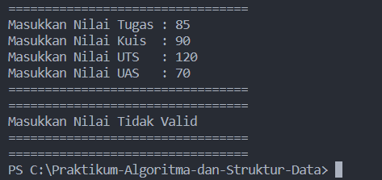
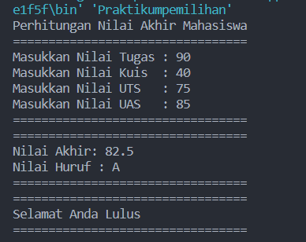

### 2. **Perulangan**
Membuat program yang dapat menampilkan deretan bilangan dari angka 1 sampai n kecuali
angka 6 dan 10, angka ganjil dicetak dengan asterik “*”, angka genap dicetak sesuai bilangan
aslinya, dengan n = 2 digit terakhir NIM anda.
* Output

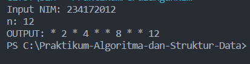

### 3. **Array**
Membuat program untuk menghitung IP Semester dari matakuliah yang Anda tempuh
semester lalu. Formula untuk menghitung IP semester sebagai berikut :
*𝐼𝑃 𝑆𝑒𝑚𝑒𝑠𝑡𝑒𝑟 = ∑𝑖(𝑁𝑖𝑙𝑎𝑖 𝑆𝑒𝑡𝑎𝑟𝑎𝑖 ∗ 𝑏𝑜𝑏𝑜𝑡 𝑆𝐾𝑆𝑖) / ∑ 𝑆𝐾𝑆*
Input dari program berupa nama matakuliah, bobot SKS, serta nilai huruf dari matakuliah 
tersebut
* Output

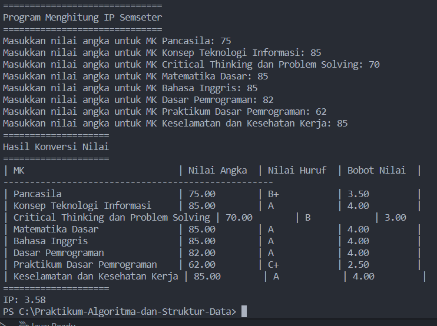

### 4. **Fungsi**
1. Membuat fungsi untuk menampilkan pendapatan setiap cabang jika semua bunga habis
terjual.
2. Membuat fungsi untuk mengetahui jumlah Stock setiap jenis bunga pada cabang royalgarden 4. 
Jika terdapat informasi tambahan berupa pengurangan stock karena bunga tersebut mati.
Dengan rincian Aglonema -1, Keladi -2, Alocasia -0, Mawar -5.
* Output
1. 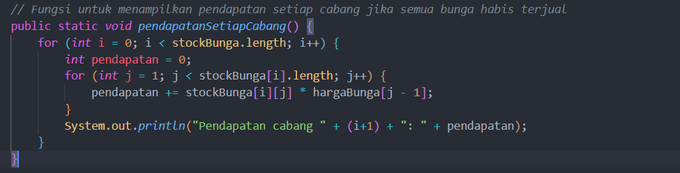
2. 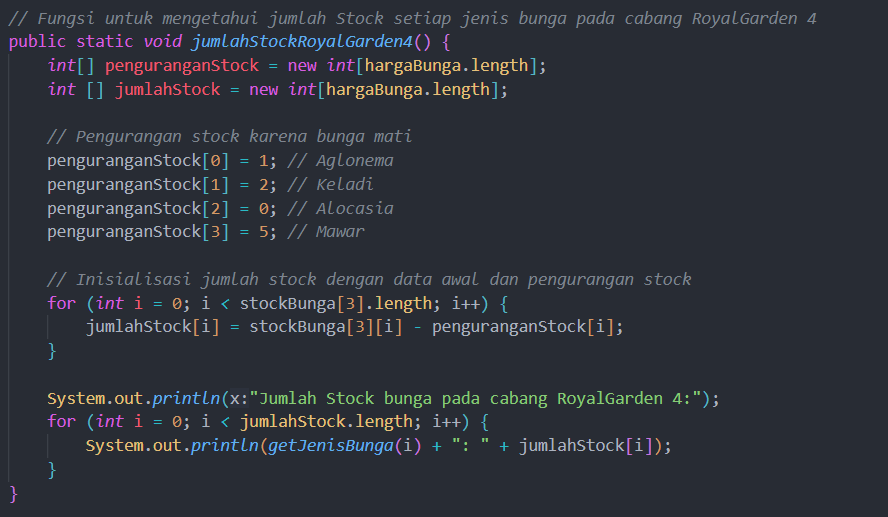

### **Tugas 1**
Membuat program untuk membuat dua buah array berikut isinya sebagai berikut. Array
pertama adalah array satu dimensi char KODE[10], berisi kode plat mobil. Array kedua, array
dua dimensi char KOTA[10][12] berisi nama kota yang berpasangan dengan kode plat mobil. 

* Kode Program 
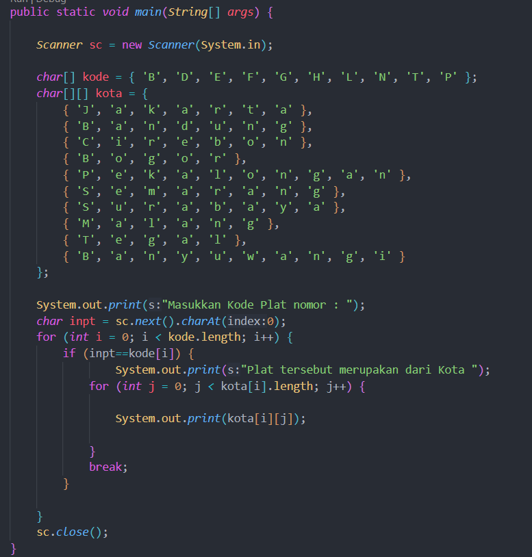
* Output
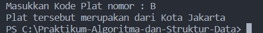

### **Tugas 2**
Buat program untuk menghitung rumus kecepatan, jarak, dan waktu.
1. Kode Program fungsi Menu 
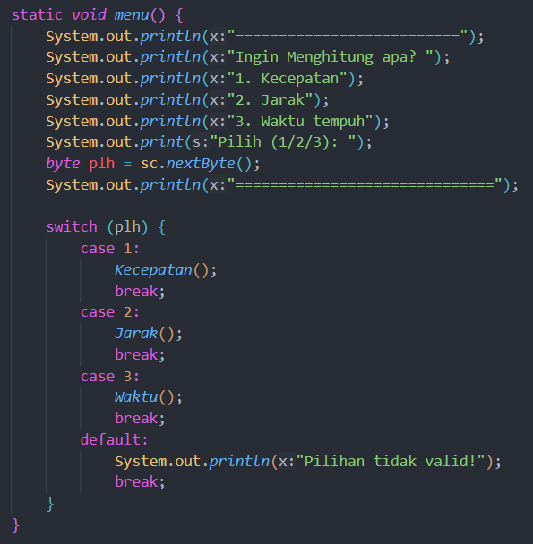
2. Kode Program fungsi hitung kecepatan
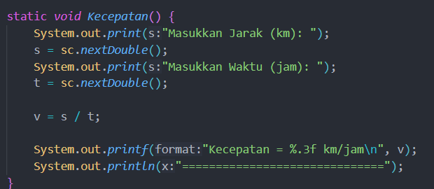
3. Kode Program fungsi hitung Jarak
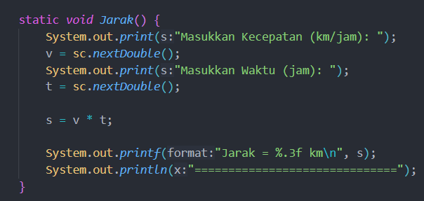
4. Kode Program fungsi hitung Waktu
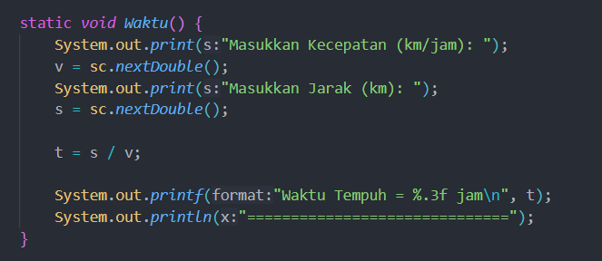
* Output
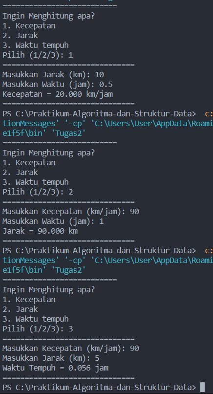

