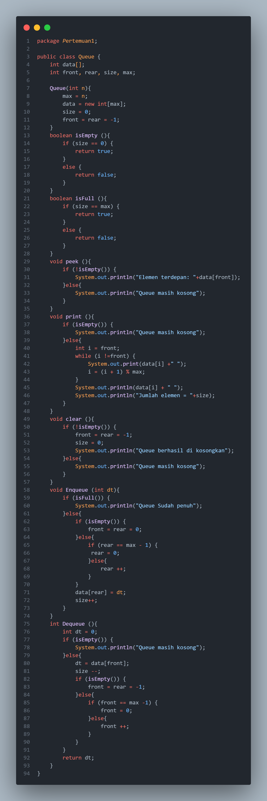
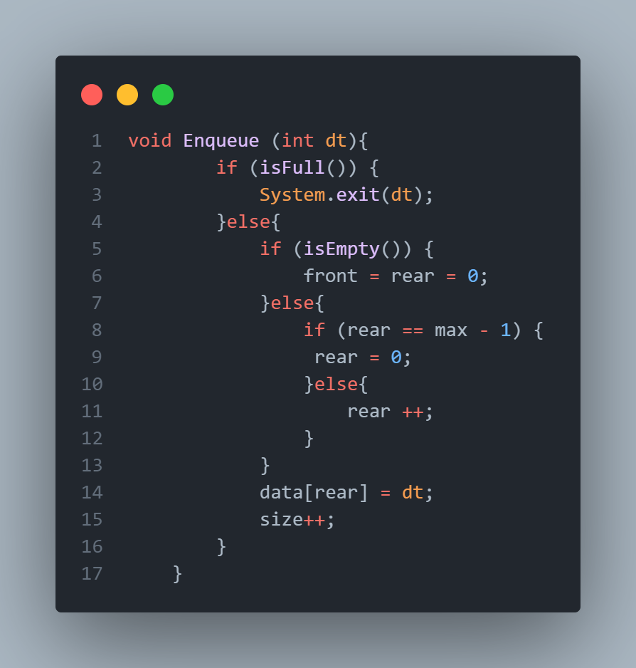

# **Laporan Jobsheet 10**
---
## Nama    : Fali Irham Maulana
## No      : 10
## Kelas   : 1-H
## NIM     : 2341720121

### 10.1 Tujuan Praktikum 
Setelah melakukan materi praktikum ini, mahasiswa mampu:

1. Mengenal struktur data Queue

2. Membuat dan mendeklarasikan struktur data Queue

3. Menerapkan algoritma Queue dengan menggunakan array
-----------
### 10.2  Praktikum 1 
Pada percobaan ini, kita akan mengimplementasikan penggunaan class Queue.

**Kode Program :**

- **Queue Class :**

- **Queue Main Class :**

-------------------------
### 10.2.1 Verifikasi Hasil Percobaan 

--------------------------------------
### 10.2.2 Pertanyaan 
1. Pada konstruktor, mengapa nilai awal atribut front dan rear bernilai -1, sementara atribut size 
bernilai 0?

_Jawaban :_ Pada konstruktor, nilai awal atribut front dan rear diatur ke -1 sedangkan size diatur ke 0 untuk menandakan bahwa pada awalnya antrian (queue) dalam keadaan kosong. Ketika front dan rear bernilai -1, ini mengindikasikan bahwa tidak ada elemen yang tersimpan dalam antrian. Selain itu, size yang bernilai 0 menunjukkan bahwa jumlah elemen saat itu adalah nol.

2. Pada method Enqueue, jelaskan maksud dan kegunaan dari potongan kode berikut!

_Jawaban :_ Potongan kode `if (rear == max - 1) { rear = 0;`  dalam method Enqueue memiliki maksud dan kegunaan untuk menangani kondisi di mana rear mencapai batas maksimal dari array antrian (max - 1) kode tersebut membantu dalam mengimplementasikan antrian sirkular, di mana penambahan elemen terus dilakukan tanpa harus khawatir tentang batasan akhir dari array yang digunakan untuk menyimpan elemen-antrian.

3. Pada method Dequeue, jelaskan maksud dan kegunaan dari potongan kode berikut!

_Jawaban :_  Potongan kode `if (front == max - 1) { front = 0; }` ini membantu dalam mengimplementasikan antrian sirkular, di mana penghapusan elemen dari depan antrian akan terus dilakukan dengan melanjutkan dari awal array setelah mencapai batas akhir dari array yang digunakan untuk menyimpan elemen-antrian.

4. Pada method print, mengapa pada proses perulangan variabel i tidak dimulai dari 0 (int i=0), 
melainkan int i=front?

_Jawaban :_  Pada method print, perulangan dimulai dari front karena antrian tidak selalu dimulai dari indeks 0. karena elemen mungkin dimulai dari posisi lain selain 0 tergantung pada bagaimana elemen-elemen dimasukkan dan dihapus dari antrian. Dengan memulai perulangan dari front, kita dapat mencetak elemen-elemen antrian berurutan, mengikuti urutan penyimpanan aktual di dalam array.

5. Perhatikan kembali method print, jelaskan maksud dari potongan kode berikut!

_Jawaban :_ Potongan kode `i = (i + 1) % max;` dalam method print digunakan untuk menggerakkan variabel i ke elemen berikutnya dalam antrian, dengan memperhitungkan sifat sirkular dari antrian.

6. Tunjukkan potongan kode program yang merupakan queue overflow!

_Jawaban :_ queue overflow terjadi pada method Enqueue. Contohnya, jika antrian sudah terisi dengan elemen maksimal (size == max) dan kemudian Enqueue dipanggil untuk menambahkan elemen baru, akan dikeluarkan pesan "Queue Sudah penuh" sebagai indikasi overflow.

7. Pada saat terjadi queue overflow dan queue underflow, program tersebut tetap dapat berjalan dan hanya menampilkan teks informasi. Lakukan modifikasi program sehingga pada saat terjadi queue overflow dan queue underflow, program dihentikan! 

_Jawaban :_  

- **Modifikasi saat Overflow :**  

- **Modifikasi saat Underflow :** 

-------------------------------------------
### 10.3  Praktikum 2
membuat program yang mengilustrasikan teller di bank dalam melayani nasabah.

**Kode Program :**

- **Nasabah Class :**

- **Queue2 Class :**

- **Queue Main 2 Class :**

---------------------------
### 10.3.1 Verifikasi hasil Percoban

-----------------------------
### 10.3.2 Pertanyaan 
1. Pada class QueueMain, jelaskan fungsi IF pada potongan kode program berikut!

_Jawaban:_  kondisi `if` tersebut memeriksa apakah semua atribut dari objek data memiliki nilai yang tidak null (untuk string) dan tidak sama dengan 0 (untuk integer dan double). Jika semua kondisi terpenuhi, maka pesan yang berisi informasi tentang nasabah yang keluar akan dicetak.

2. Lakukan modifikasi program dengan menambahkan method baru bernama peekRear pada class Queue yang digunakan untuk mengecek antrian yang berada di posisi belakang! Tambahkan pula daftar menu 5. Cek Antrian paling belakang pada class QueueMain sehingga method peekRear
dapat dipanggil! 

_Jawaban:_ 

**Modifikasi pada Queue2 Class :**

**Modifikasi pada QueueMain2 Class :**

**Output :**

--------------------------
### 10.4 Tugas 
Buatlah program antrian untuk mengilustasikan pesanan disebuah warung. Ketika seorang 
pembeli akan mengantri, maka dia harus mendaftarkan nama, dan nomor HP seperti yang 
digambarkan pada Class diagram berikut:

Class diagram Queue digambarkan sebagai berikut:

Keterangan:

• Method create(), isEmpty(), isFull(), enqueue(), dequeue() dan print(), kegunaannya sama seperti 
yang telah dibuat pada Praktikum

• Method peek(): digunakan untuk menampilkan data Pembeli yang berada di posisi antrian paling 
depan

• Method peekRear(): digunakan untuk menampilkan data Pembeli yang berada di posisi antrian 
paling belakang

• Method peekPosition(): digunakan untuk menampilkan seorang pembeli (berdasarkan nama)
posisi antrian ke berapa

• Method daftarPembeli(): digunakan untuk menampilkan data seluruh pembeli

_Jawaban :_

**Kode Program :**

- **Pembeli Class:** 

- **Queue Class:**

- **Pembeli Java:**

**Output Kode Program :**

-------------------------------

