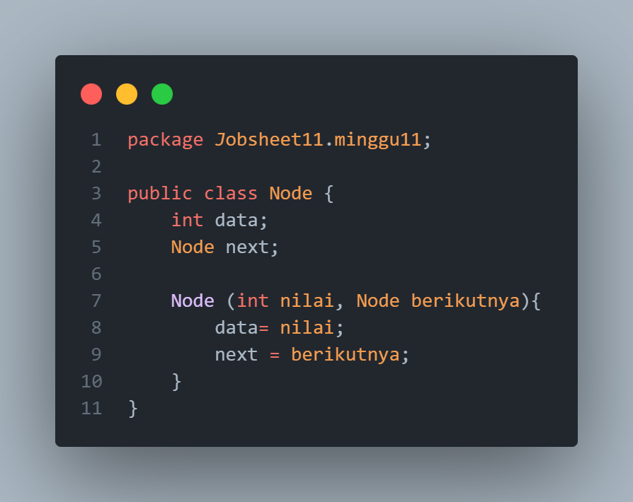
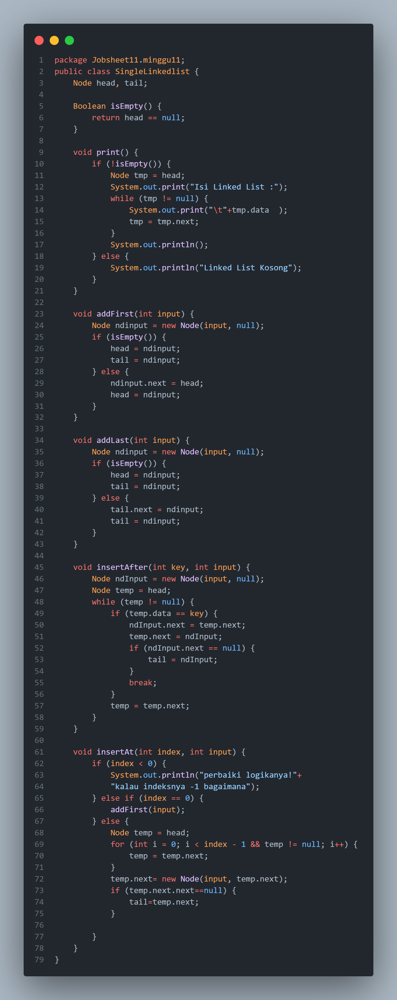
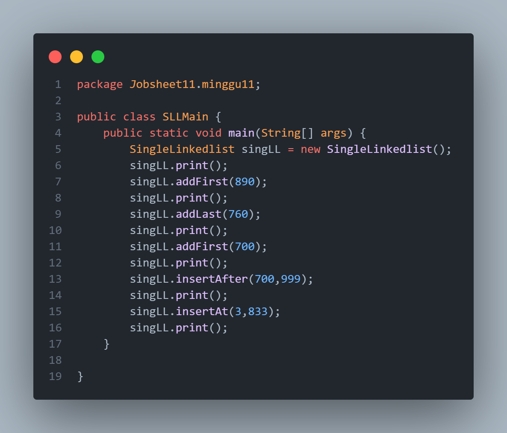
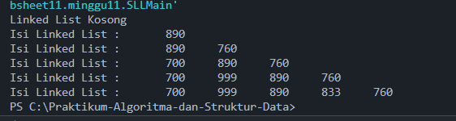

# **Laporan Jobsheet 9**
---
## Nama    : Fali Irham Maulana
## No      : 10
## Kelas   : 1-H
## NIM     : 2341720121
---
### 9.1 Tujuan Praktikum 
Setelah melakukan materi praktikum ini, mahasiswa mampu:

1. Membuat struktur data linked list

2. Membuat linked list pada program

3. Membedakan permasalahan apa yang dapat diselesaikan menggunakan linked list
-----
### 9.2 Praktikum 
### 9.2.1 Pembuatan Single Linked List
**Kode Program :** 

- **Node Class :**

- **SingleLinkedList Class :**

- **SLLMain Class :**

-----
### 9.2.1.2 Verifikasi Hasil Percobaan 

---------
### 9.2.1.3 Pertanyaan 
1. Mengapa hasil compile kode program di baris pertama menghasilkan “Linked List Kosong”?

_Jawaban :_ Pesan "Linked List Kosong" muncul pada kompilasi program karena ketika method print() dipanggil, kondisi isEmpty() mengembalikan true, yang menunjukkan bahwa head dari linked list adalah null. Ini mengindikasikan bahwa linked list belum berisi node apa pun, sehingga diputuskan bahwa linked list kosong.

2. Jelaskan kegunaan variable temp secara umum pada setiap method!

_Jawaban :_ `temp` adalah penunjuk yang digunakan untuk melacak posisi saat melakukan operasi pada linked list, seperti mencari, menambah, atau menyisipkan node pada posisi tertentu dalam struktur data linked list

3. Perhatikan class SingleLinkedList, pada method insertAt Jelaskan kegunaan kode berikut 

_Jawaban :_ `if (temp.next.next == null) { tail = temp.next; }:` berguna memeriksa apakah node baru (temp.next) adalah node terakhir dalam linked list. Jika ya, maka tail diperbarui untuk menunjuk ke node baru ini, karena node baru telah disisipkan di akhir linked list.
--------------
### 9.2.2 Modifikasi Elemen pada Single Linked List
