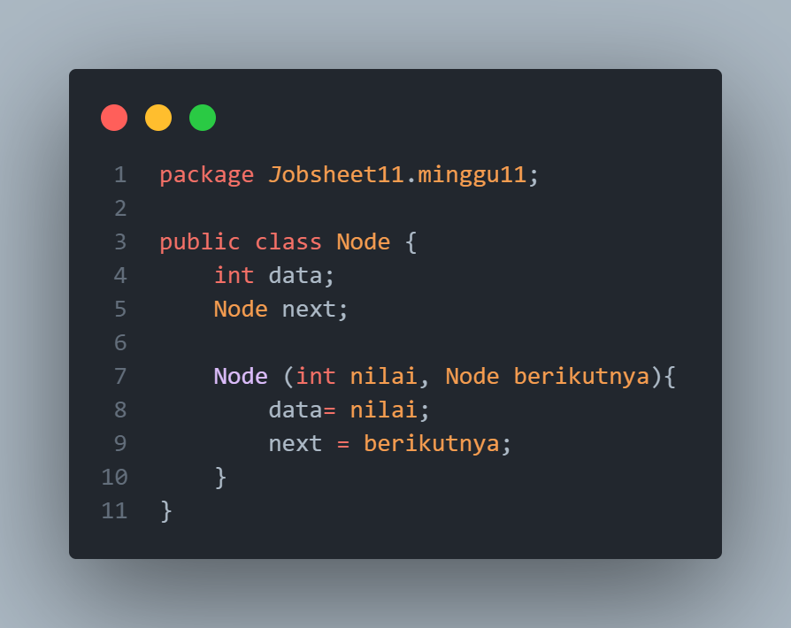

# **Laporan Jobsheet 12**
---
## Nama    : Fali Irham Maulana
## No      : 10
## Kelas   : 1-H
## NIM     : 2341720121
---
### 12.1 Tujuan Praktikum 
Setelah melakukan praktikum ini, mahasiswa mampu:

1. memahami algoritma double linked lists;

2. membuat dan mendeklarasikan struktur algoritma double linked lists;

3. menerapkan algoritma double linked lists dalam beberapa study case.
------------------------
### 12.2  Percobaan 1
Pada percobaan 1 ini akan dibuat class Node dan class DoubleLinkedLists yang didalamnya terdapat 
operasi-operasi untuk menambahkan data dengan beberapa cara (dari bagian depan linked list, 
belakang ataupun indeks tertentu pada linked list).

**Kode Program :** 

- **Node Class :**

- **DoubleLinkedList Class:** 

- **DoubleLinkedList Main Class:** 

-----------------------
### 12.2.1 Verifikasi Hasil Percobaan 

----------------------
### 12.2.2 Pertanyaan Percobaan 

1.  Jelaskan perbedaan antara single linked list dengan double linked lists!

_Jawaban :_ 

2.  Perhatikan class Node, di dalamnya terdapat atribut next dan prev. Untuk apakah atribut 
tersebut?

_Jawaban :_ 

3. Perhatikan konstruktor pada class DoubleLinkedLists. Apa kegunaan inisialisasi atribut head dan 
size seperti pada gambar berikut ini?

_Jawaban :_

4. Pada method addFirst(), kenapa dalam pembuatan object dari konstruktor class Node prev 
dianggap sama dengan null?

_Jawaban :_ 

5.  Perhatikan pada method addFirst(). Apakah arti statement `head.prev = newNode` ?

_Jawaban :_

6. Perhatikan isi method addLast(), apa arti dari pembuatan object Node dengan mengisikan 
parameter prev dengan current, dan next dengan null?

_Jawaban :_

7. Pada method add(), terdapat potongan kode program sebagai berikut:

_Jawaban :_ 

----------------

### 12.3 Percobaan 2 
Pada percobaan 2 ini akan dibuat beberapa method untuk menghapus isi LinkedLists pada  class DoubleLinkedLists. Penghapusan dilakukan dalam tiga cara di bagian paling depan, paling  belakang, dan sesuai indeks yang ditentukan pada linkedLists.

**Kode Program :** 

- **Node Class :**

- **DoubleLinkedList Class:** 

- **DoubleLinkedList Main Class:** 

-----------------------
### 12.3.1 Verifikasi Hasil Percobaan 

------------------------
### 12.3.2 Pertanyaan Percobaan
1. Apakah maksud statement berikut pada method removeFirst()? 

_Jawaban :_

2. Bagaimana cara mendeteksi posisi data ada pada bagian akhir pada method removeLast()?

_Jawaban :_

3. Jelaskan alasan potongan kode program di bawah ini tidak cocok untuk perintah remove!

 _Jawaban :_ 

4. Jelaskan fungsi kode program berikut ini pada fungsi remove!

_Jawaban :_

### Percobaan 3 
Pada Percobaan 3 ini dilakukan uji coba untuk mengambil data pada linked list dalam 3 kondisi, yaitu mengambil data paling awal, paling akhir dan data pada indeks tertentu dalam linked list. Method mengambil data dinamakan dengan get

**Kode Program :** 

- **Node Class :**

- **DoubleLinkedList Class:** 

- **DoubleLinkedList Main Class:** 

-----------------------

