# **Laporan Jobsheet 14**
---
## Nama    : Fali Irham Maulana
## No      : 10
## Kelas   : 1-H
## NIM     : 2341720121
---
### 13.1 Tujuan Praktikum 
Setelah melakukan praktikum ini, mahasiswa mampu: 

1. memahami model Tree khususnya Binary Tree

2. membuat dan mendeklarasikan struktur algoritma Binary Tree.

3. menerapkan dan mengimplementasikan algoritma Binary Tree dalam kasus Binary Search 
Tree
------------------------
### 13.2 Kegiatan Praktikum 1
Implementasi Binary Search Tree menggunakan Linked List
------------------------
### 13.2.1 Percobaan 1 

**Kode Program :**

- **Node 10 Class :**

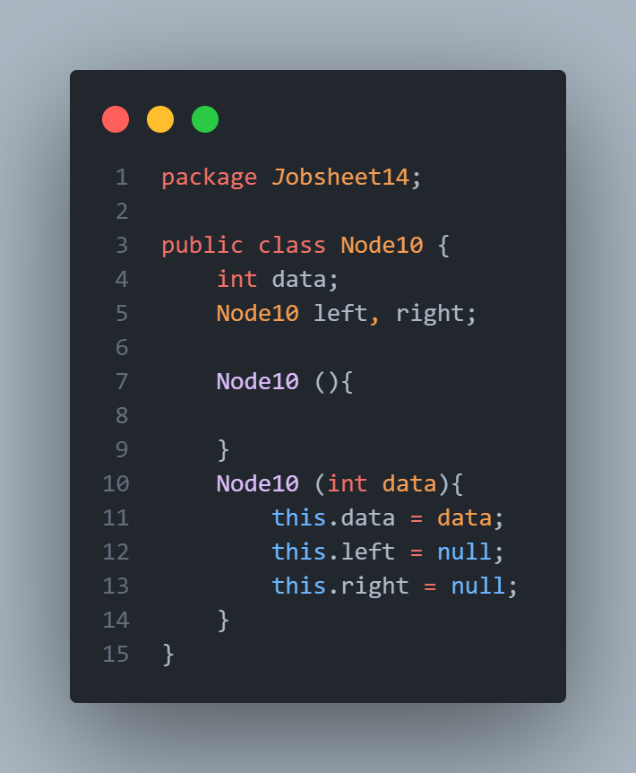

- **BinaryTree10 Class :**

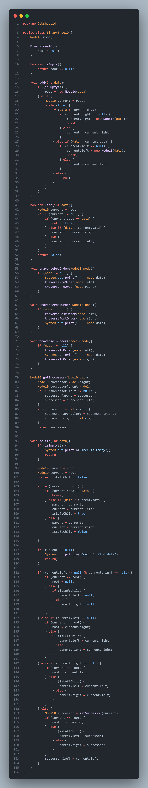

- **BinaryTreeMain10 Class :**

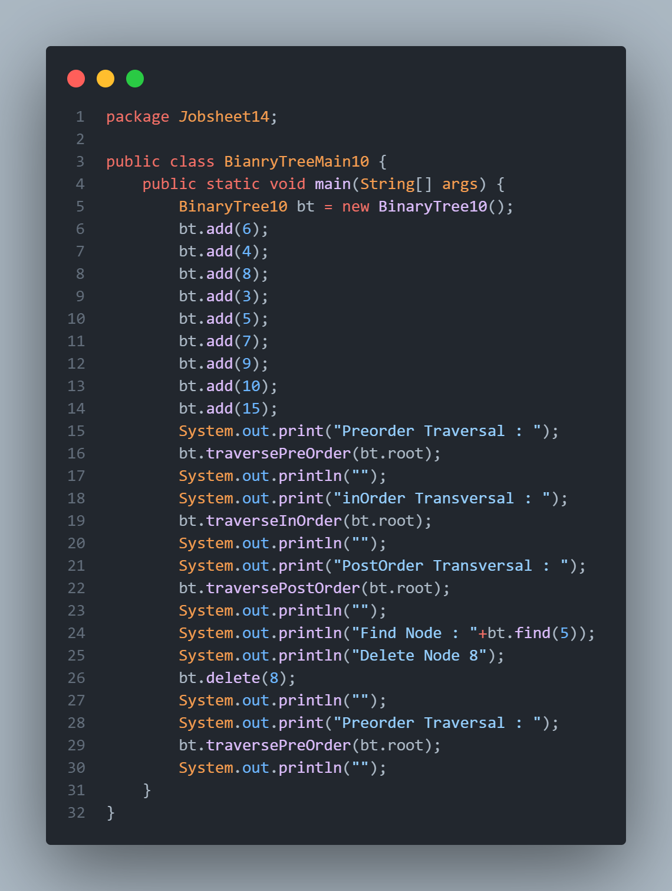

**Output Kode Program :**

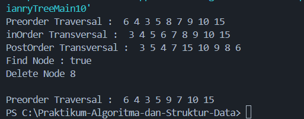
--------------------------------
### 13.2.2 Pertanyaan Percobaan
1. Mengapa dalam binary search tree proses pencarian data bisa lebih efektif dilakukan dibanding 
binary tree biasa?

_Jawaban :_ Karena binary search tree memiliki sifat bahwa semua elemen di subpohon kiri lebih kecil dan di subpohon kanan lebih besar daripada node saat ini sehingga memudahkan pencarian.

2. Untuk apakah di class Node, kegunaan dari atribut left dan right?

_Jawaban :_ Atribut left dan right dalam class Node digunakan untuk merepresentasikan referensi ke child left dan right dari node tersebut dalam struktur pohon biner. Atribut tersebut memungkinkan kita untuk menghubungkan node-node dalam pohon sehingga membentuk struktur yang hierarkis. dimana `left` menunjuk ke anak kiri, yang menyimpan nilai yang lebih kecil dari nilai node saat ini.
`right` menunjuk ke anak kanan, yang menyimpan nilai yang lebih besar dari nilai node saat ini.

3.  a. Untuk apakah kegunaan dari atribut root di dalam class BinaryTree?

_Jawaban :_ Atribut `root` di dalam class BinaryTree digunakan untuk menyimpan referensi ke node pertama atau paling atas dalam tree. 

    b. Ketika objek tree pertama kali dibuat, apakah nilai dari root?

_Jawaban :_ Ketika objek tree pertama kali dibuat, nilai dari root adalah null, yang menunjukkan bahwa tree tersebut masih kosong dan belum ada node yang ditambahkan.

4. Ketika tree masih kosong, dan akan ditambahkan sebuah node baru, proses apa yang akan terjadi?

_Jawaban :_ Node baru tersebut akan menjadi root dari tree.

5. Perhatikan method add(), di dalamnya terdapat baris program seperti di bawah ini. Jelaskan 
secara detil untuk apa baris program tersebut?
`if(data<current.data){`
    `if(current.left!=null){`
       `current = current.left;`
    `}else{`
        `current.left = new Node(data);`
    `break;`
    `}`
`}`

_Jawaban :_ Memeriksa apakah data lebih kecil dari current.data. Jika ya, pindah ke anak kiri jika ada (current = current.left). Jika tidak ada, tambahkan node baru di posisi tersebut (current.left = new Node10(data)) dan keluar dari loop (break).
-------------------------
### 13.3  Kegiatan Praktikum 2
Implementasi binary tree dengan array
---------------------------
### 13.3.1 Percobaan 2
- **BinaryTreeArray10 Class :**

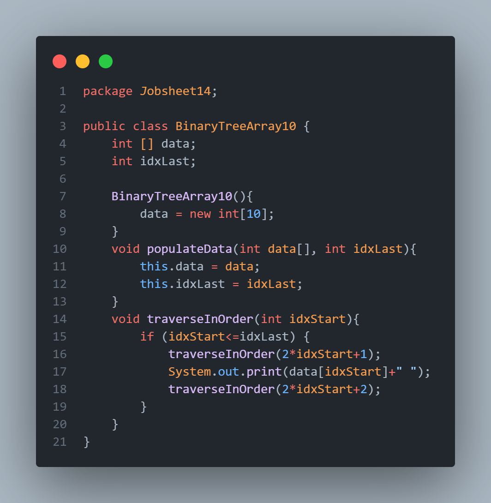

- **BinaryTreeArrayMain10 Class :**

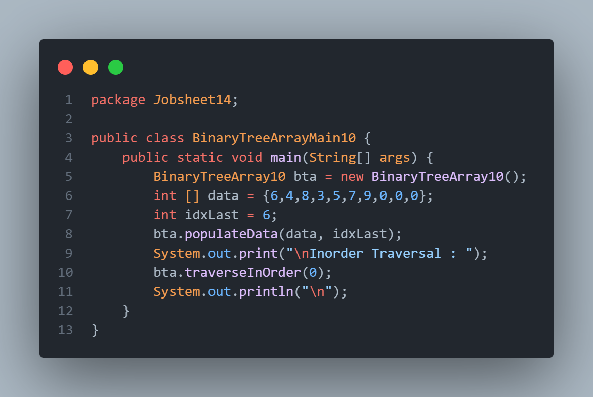

**Output Kode Program :**

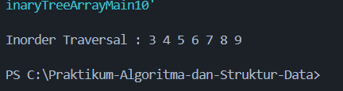
--------------------------------
### 13.3.2 Pertanyaan Percobaan
1. Apakah kegunaan dari atribut `data` dan `idxLast` yang ada di class BinaryTreeArray?

_Jawaban :_ 

- `data`: Array yang digunakan untuk menyimpan elemen-elemen dari binary tree.

- `idxLast`: Menyimpan indeks terakhir dari elemen yang ada di array `data`, menunjukkan batas dari elemen-elemen yang relevan dalam array.

2. Apakah kegunaan dari method populateData()?

_Jawaban :_ Method `populateData()` digunakan untuk mengisi array data dan mengatur `idxLast` dengan nilai-nilai yang diberikan sebagai parameter, sehingga binary tree dapat diinisialisasi dengan data yang sudah ada.

3. Apakah kegunaan dari method `traverseInOrder()`?

_Jawaban :_ Method  `traverseInOrder()` digunakan untuk melakukan traversal inorder pada binary tree yang disimpan dalam array. Traversal inorder mengunjungi node dalam urutan: anak kiri, node saat ini, kemudian anak kanan.

4. Jika suatu node binary tree disimpan dalam array indeks 2, maka di indeks berapakah posisi 
left child dan rigth child masin-masing?

_Jawaban :_ 

- Left child: 2 * 2 + 1 = 5

- Right child: 2 * 2 + 2 = 6

5. Apa kegunaan statement int idxLast = 6 pada praktikum 2 percobaan nomor 4? 

_Jawaban :_ Statement int idxLast = 6 digunakan untuk menunjukkan bahwa elemen terakhir yang valid dalam array data berada pada indeks 6. dimana dapat membantu untuk menentukan batas saat melakukan traversal agar tidak mengakses elemen di luar indeks yang berisi data.
------------------------
### 13.4  Tugas Praktikum 
1. Buat method di dalam class BinaryTree yang akan menambahkan node dengan cara 
rekursif.

2. Buat method di dalam class BinaryTree untuk menampilkan nilai paling kecil dan yang 
paling besar yang ada di dalam tree.

3. Buat method di dalam class BinaryTree untuk menampilkan data yang ada di leaf.

4. Buat method di dalam class BinaryTree untuk menampilkan berapa jumlah leaf yang ada 
di dalam tree.

5. Modifikasi class BinaryTreeArray, dan tambahkan : 
• method `add(int data)` untuk memasukan data ke dalam tree 
• method `traversePreOrder()` dan `traversePostOrder()`

- **Jawaban no 1-4 :**

**Kode Program :**

_BinaryTree10 Class :_

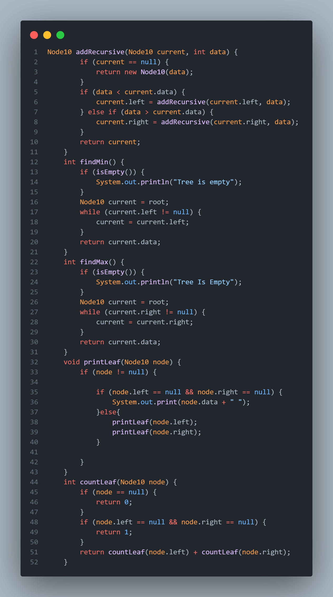

_BinaryTreeMain10 Class :_

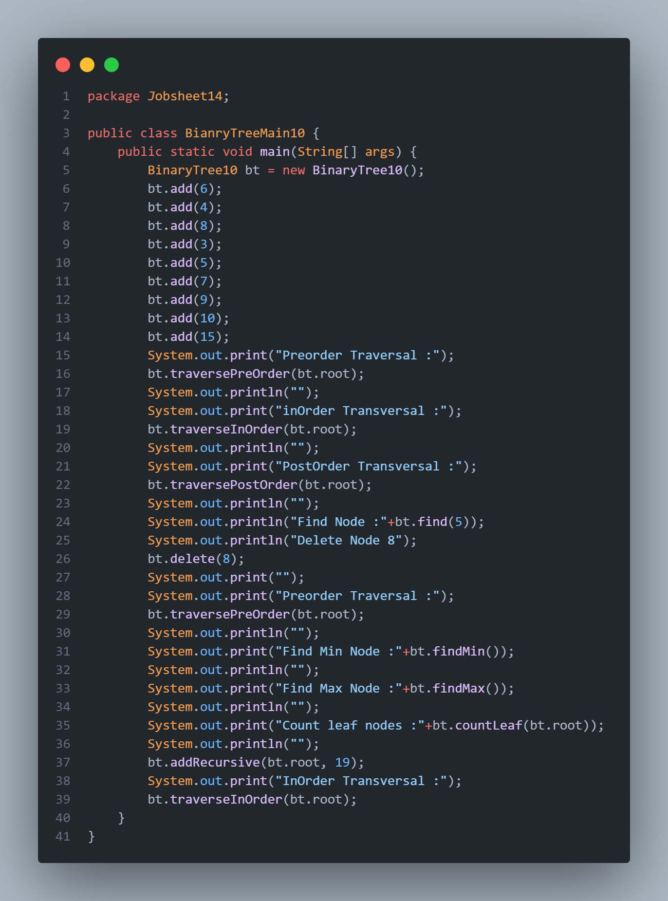

_Output :_

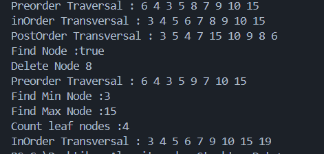

- **Jawaban no 5 :**

_BinaryTreeArray10 Class :_

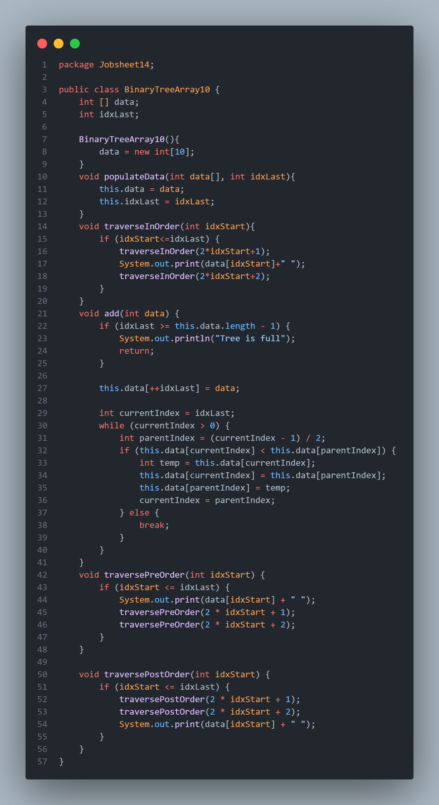

_BinaryTreeAraayMain10 Class :_

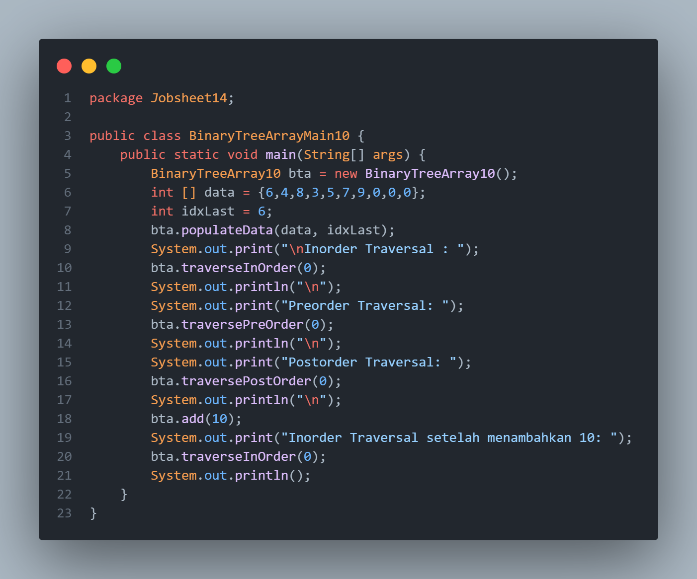

_Output :_

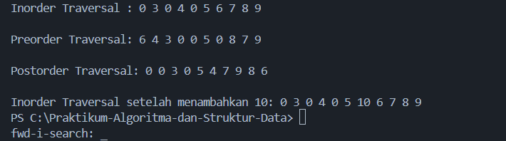

