# **Laporan Jobsheet 15**
---
## Nama    : Fali Irham Maulana
## No      : 10
## Kelas   : 1-H
## NIM     : 2341720121
---
### 15.1 Tujuan Praktikum
Setelah melakukan praktikum ini, mahasiswa mampu:

1. memahami model graph

2. membuat dan mendeklarasikan struktur algoritma graph

3. menerapkan algoritma dasar graph dalam beberapa studi kasus 
---------------
### 15.2 Praktikum 
### 15.2.1.1 Percobaan 1 : Implementasi Graph menggunakan Linked List 
Sebuah universitas membuat program untuk memodelkan graf berarah berbobot yang mewakili 
gedung-gedung dan jarak antar gedung tersebut menggunakan Linked List. Setiap gedung 
dihubungkan dengan jalan yang memiliki jarak tertentu (dalam meter).

**Kode Program :** 

- **Node10 Class :**

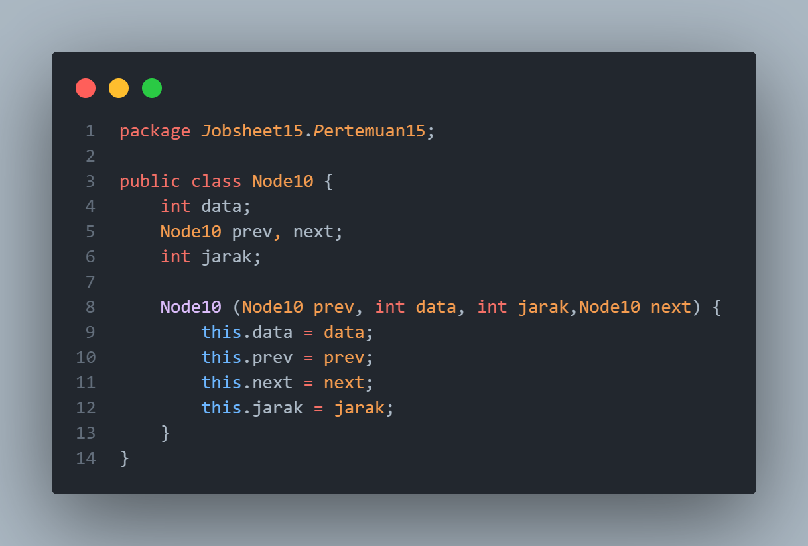

- **DoubleLinkedList Class :**

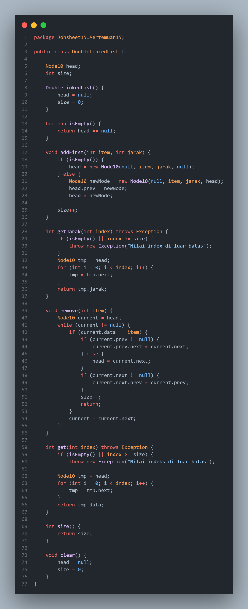

- **Graph10 Class :**

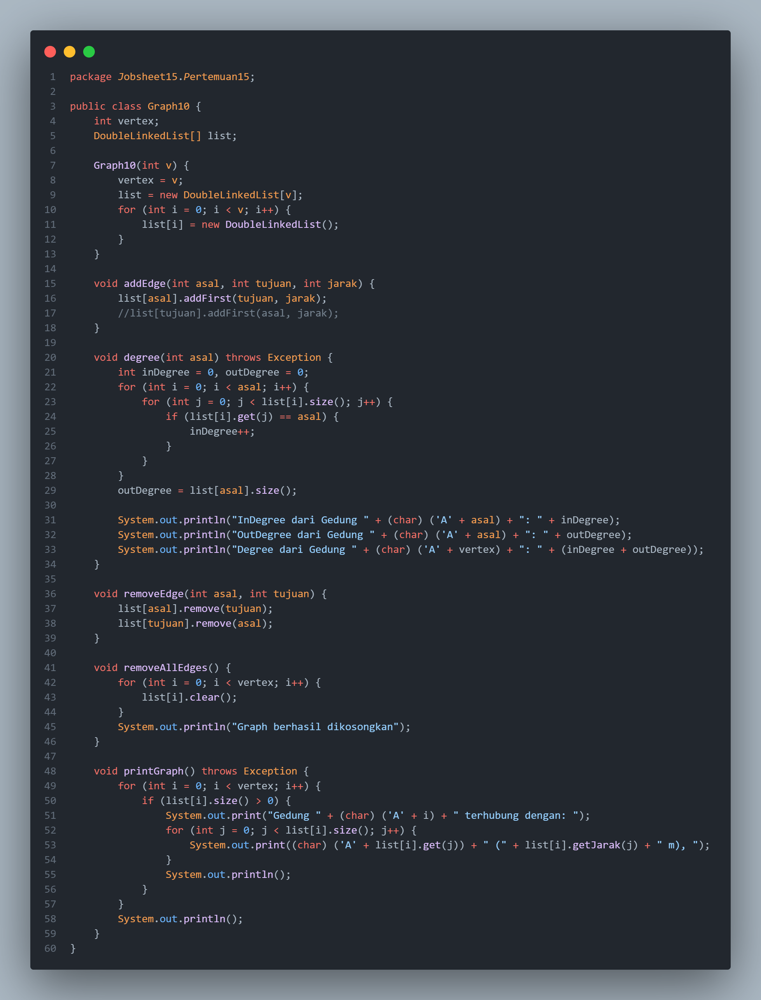

- **GraphMain Class :**

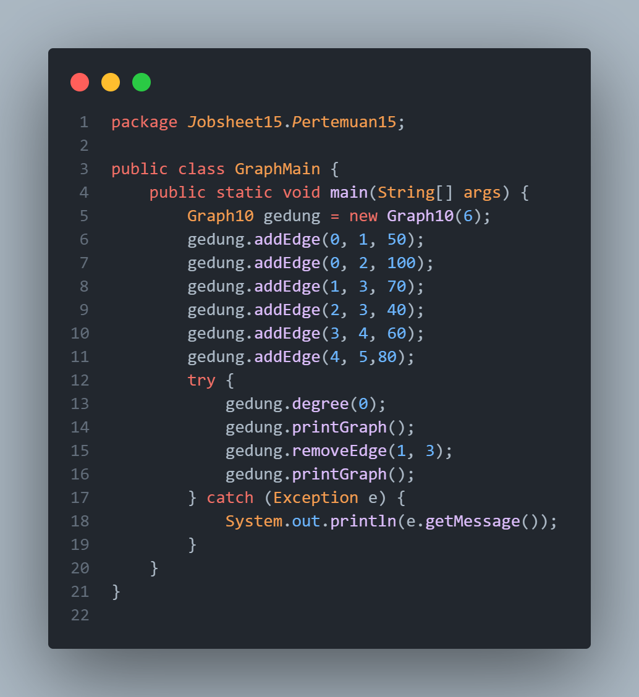
-----------------------
### 15.2.1.2 Verifikasi Hasil Percobaan 
**Output Kode Program :**

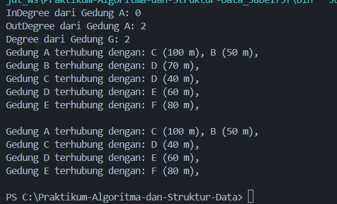
-----------------------
### 15.2.1.3 Pertanyaan 
1. Perbaiki kode program Anda apabila terdapat error atau hasil kompilasi kode tidak sesuai!

_Jawaban :_ Perbaikan dilakukan pada fungsi `degree` dimana perbaikan yang dilakukan adalah berikut :

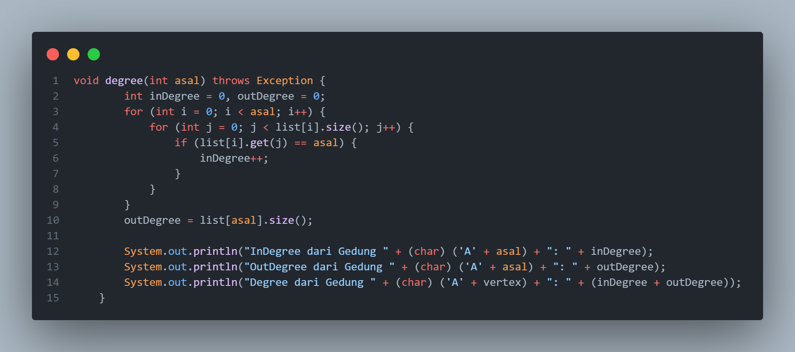

dimana pada fungsi `degree` `outDegree` nya diubah dari yang awalnya menggunakan looping menjadi tidak memakai looping, serta 
`outDegree` yang awalnya `outDegree = k` diubah menajdi `outDegree = list[asal].size();` 

2. Pada class Graph, terdapat atribut list[] bertipe DoubleLinkedList. Sebutkan tujuan pembuatan 
variabel tersebut!

_Jawaban :_ Atribut `list[]` bertipe `DoubleLinkedList` digunakan untuk menyimpan daftar adjacency dari setiap vertex dalam graph. Setiap indeks dalam array list mewakili satu vertex, dan `DoubleLinkedList` pada indeks tersebut menyimpan semua tetangga (adjacent nodes) yang terhubung dengan vertex tersebut. 

3. Jelaskan alur kerja dari method removeEdge!

_Jawaban :_ Alur kerja method removeEdge adalah sebagai berikut:

- Method menerima dua parameter: asal (source vertex) dan tujuan (destination vertex).

- Kemudian method menghapus tujuan dari daftar adjacency asal dan menghapus asal dari daftar adjacency tujuan setelah itu melakukan penghapusan menggunakan method remove dari kelas DoubleLinkedList.

4. Apakah alasan pemanggilan method addFirst() untuk menambahkan data, bukan method add 
jenis lain saat digunakan pada method addEdge pada class Graph?

_Jawaban :_ Method addFirst digunakan untuk menambahkan elemen di awal daftar linked list dengan cepat dan efisien. Ini memastikan bahwa penambahan tepi (edge) ke dalam daftar adjacency dilakukan dengan kompleksitas waktu konstan, O(1). Metode addFirst menjamin bahwa kita tidak perlu mencari posisi tertentu untuk menambahkan elemen, berbeda dengan metode lain yang mungkin memerlukan traversal linked list.

5. Modifikasi kode program sehingga dapat dilakukan pengecekan apakah terdapat jalur antara 
suatu node dengan node lainnya, seperti contoh berikut (Anda dapat memanfaatkan Scanner).

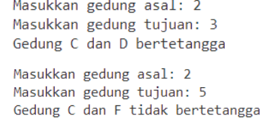

_Jawaban :_ 

**Graph10 Class :**

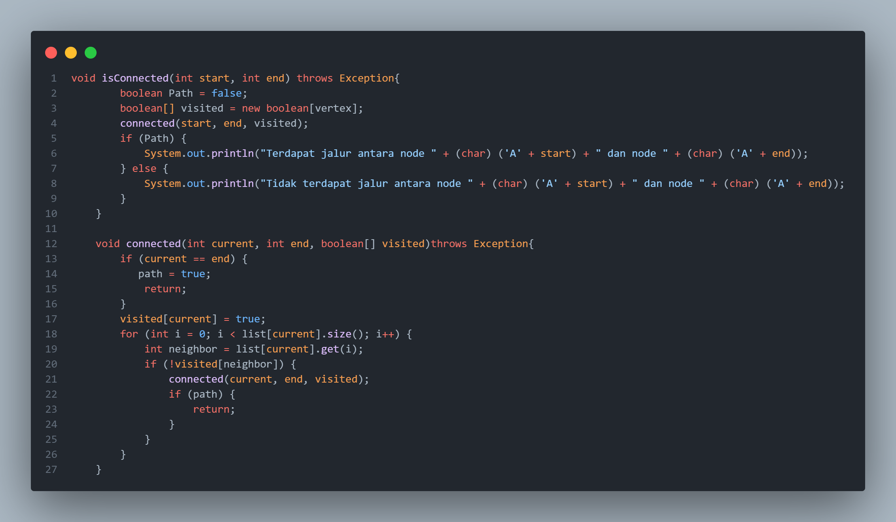

**GraphMain Class :**

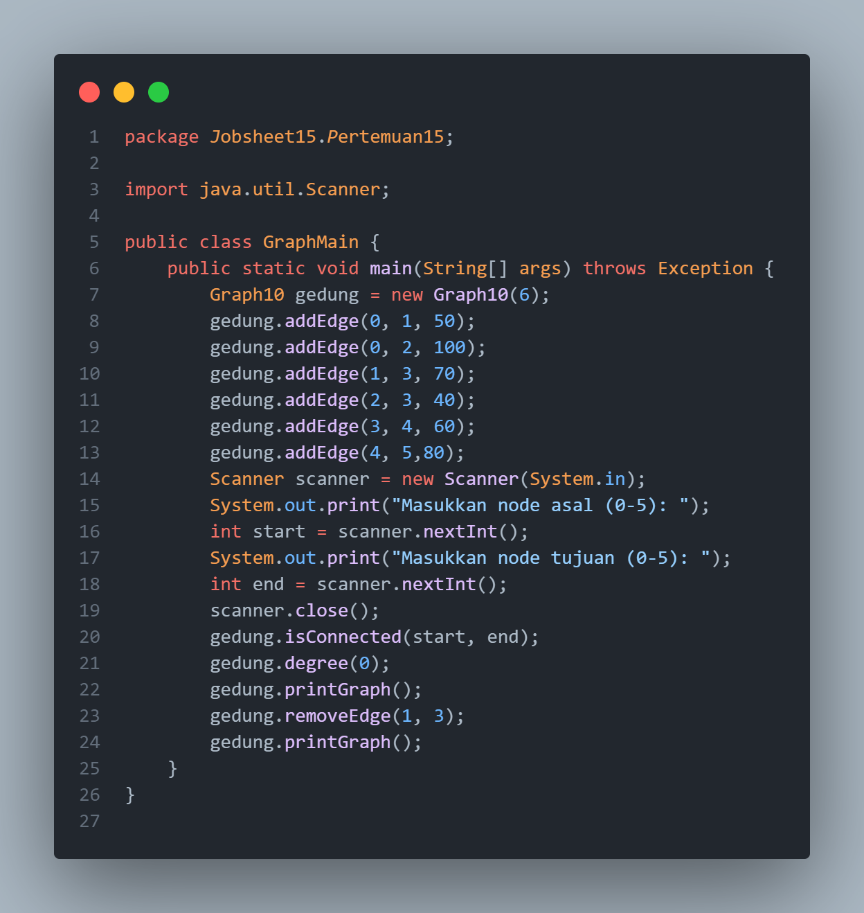

**Output :**

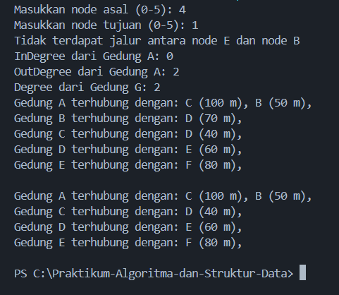
------------------------
### 15.2.2.1 Percobaan 2 : Implementasi Graph menggunakan Matriks
Dengan menggunakan kasus yang sama dengan Percobaan 1, pada percobaan ini implementasi 
graf dilakukan dengan menggunakan matriks dua dimensi.
**Kode Program :** 

- **GraphMatriks10 Class :**

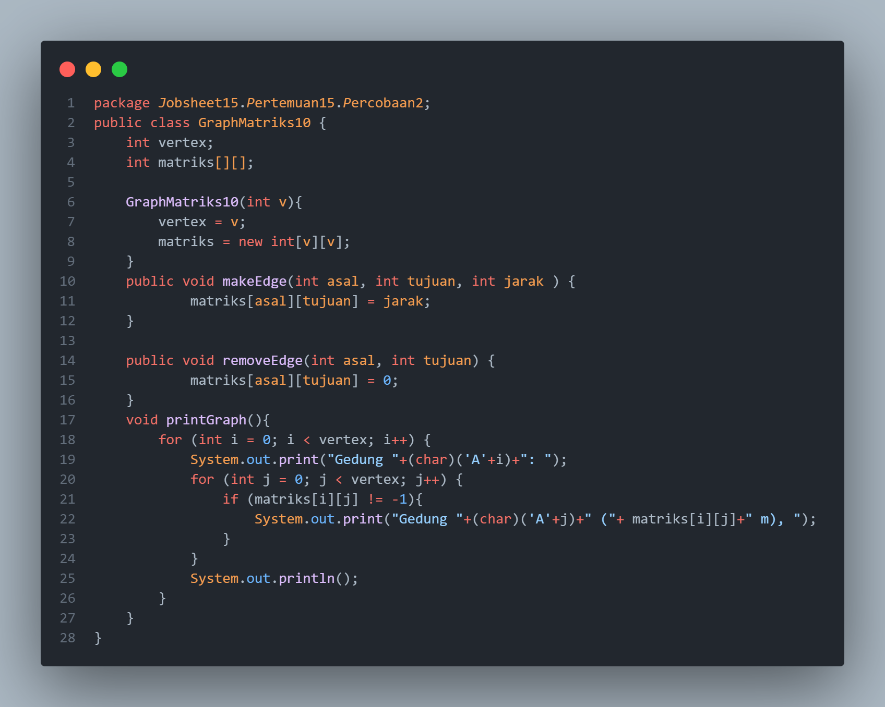

- **GraphMain Class :**

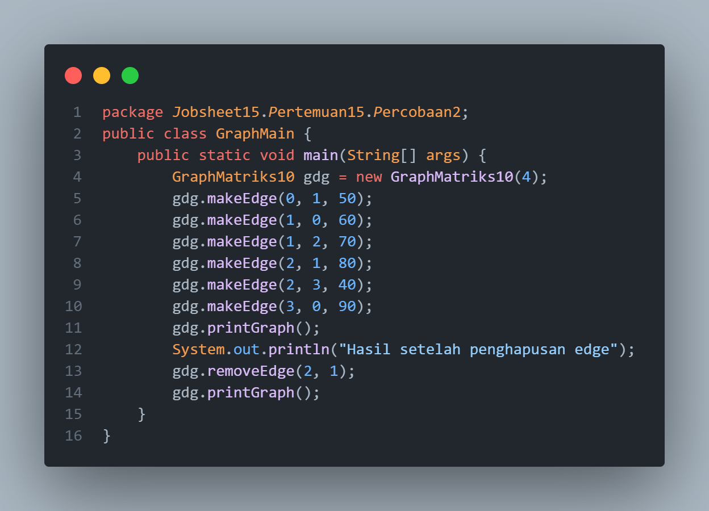
-------------------------
### 15.2.2.2 Verifikasi Hasil Percobaan
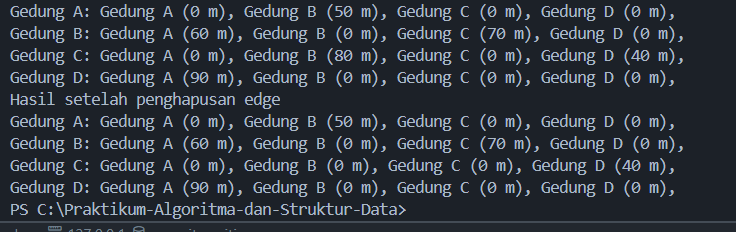
------------------------
### 15.2.2.3 Pertanyaan
1. Perbaiki kode program Anda apabila terdapat error atau hasil kompilasi kode tidak sesuai!

_Jawaban :_ kode program yang diubah adalah 
    `public void removeEdge(int asal, int tujuan) {`
            `matriks[asal][tujuan] = -1;`
    `}`
    menjadi : 
    `public void removeEdge(int asal, int tujuan) {`
            `matriks[asal][tujuan] = 0;`
    `}`

2. Apa jenis graph yang digunakan pada Percobaan 2?

_Jawaban :_ graph matriks dua dimensi 

3. Apa maksud dari dua baris kode berikut?

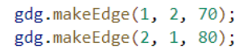

_Jawaban :_ berfungsi untuk menambahkan dua edge (sisi) dalam graf yang diwakili oleh objek gdg dari kelas GraphMatriks10. Masing-masing baris memiliki arti yang berbeda dalam konteks graf berarah (directed graph):

- gdg.makeEdge(1, 2, 70);

Menambahkan edge dari vertex 1 ke vertex 2 dengan bobot (weight) 70.Dalam adjacency matrix, ini berarti nilai pada adjMatrix[1][2] diatur menjadi 70.
- gdg.makeEdge(2, 1, 80);

Menambahkan edge dari vertex 2 ke vertex 1 dengan bobot 80.
Dalam adjacency matrix, ini berarti nilai pada adjMatrix[2][1] diatur menjadi 80.

4. Modifikasi kode program sehingga terdapat method untuk menghitung degree, termasuk 
inDegree dan outDegree!

_Jawaban :_ 
