# **LAPORAN JOBSHEET 1**
---
## Nama    : Fali Irham Maulana
## No      : 10
## Kelas   : 1-H
## NIM     : 2341720121
---
### 2.1 **Percobaan 1: Deklarasi Class, Atribut dan Method**
### 2.1.1 **Kode Program**
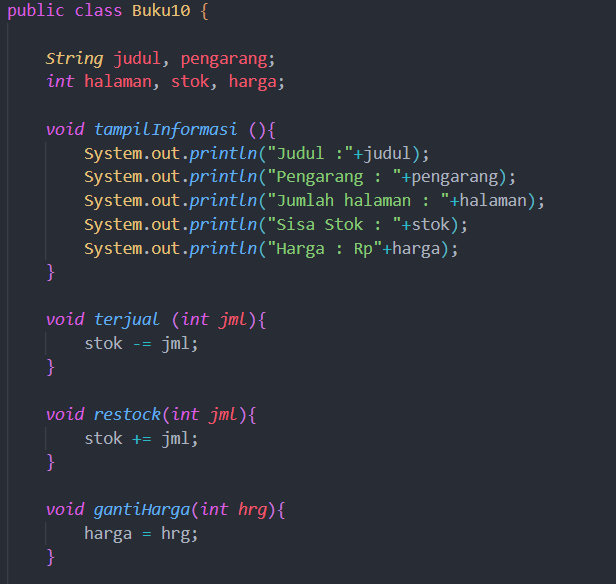
### 2.1.2 **Verifikasi Hasil Percobaan**
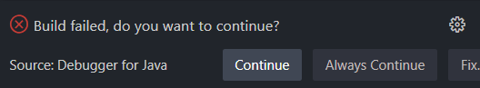
### 2.1.3 **Pertanyaan**
1. Sebutkan dua karakteristik class atau object!
jawaban = 
2. Perhatikan class Buku pada Praktikum 1 tersebut, ada berapa atribut yang dimiliki oleh class 
Buku? Sebutkan apa saja atributnya!
jawaban = Class Buku10 memiliki lima atribut:
                       a. judul (String)
                       b. pengarang (String)
                       c. halaman (int)
                       d. stok (int)
                       e. harga (int)
3. Ada berapa method yang dimiliki oleh class tersebut? Sebutkan apa saja methodnya!
jawaban : Class tersebut memiliki tiga method:
                a.tampilInformasi(): Untuk menampilkan informasi buku seperti judul, pengarang, jumlah halaman, sisa stok, dan harga.
                b.terjual(int jml): Untuk mengurangi stok buku setelah terjual sejumlah tertentu.
                c.restock(int jml): Untuk menambah stok buku dengan jumlah tertentu.
                d.gantiHarga(int hrg): Untuk mengubah harga buku menjadi nilai yang baru.
4. Perhatikan method terjual() yang terdapat di dalam class Buku. Modifikasi isi method tersebut 
sehingga proses pengurangan hanya dapat dilakukan jika stok masih ada (lebih besar dari 0)!
jawaban : 
            void terjual(int jml) {
                if (stok > 0) {
                    stok -= jml;
                } else {
                    System.out.println("Stok habis, tidak dapat melakukan penjualan.");
                }
            }
5. Menurut Anda, mengapa method restock() mempunyai satu parameter berupa bilangan int?
jawaban : Karena kita ingin menentukan jumlah tambahan stok yang akan ditambahkan. Jika parameter tidak diberi method ini tidak akan tahu berapa banyak stok yang harus ditambahkan.

### 2.2 **Percobaan 2: Instansiasi Object, serta Mengakses Atribut dan Method**
### 2.2.1 **Kode Program**
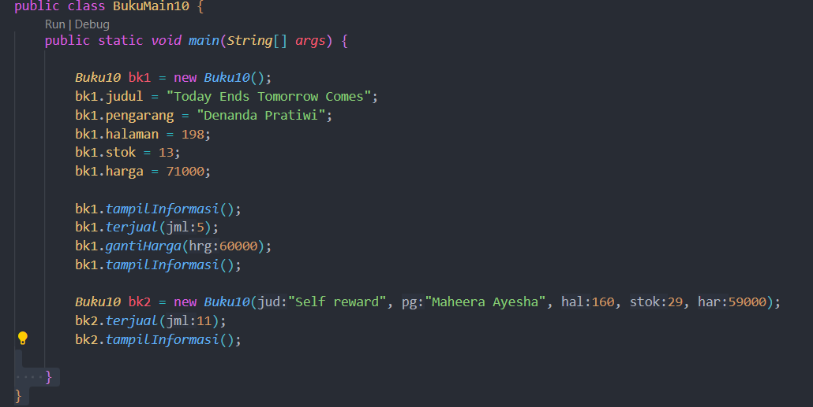
### 2.2.2 **verifikasi Hasil Percobaan**
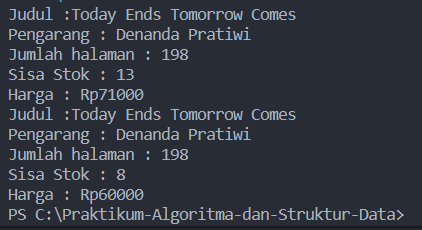
### 2.2.3 **Pertanyaan**
1. Pada class BukuMain, tunjukkan baris kode program yang digunakan untuk proses instansiasi! Apa nama object yang dihasilkan?
Jawaban : 
objek yang dihasilkan adalah 'bk1'
2. Bagaimana cara mengakses atribut dan method dari suatu objek?
Jawaban : Untuk mengakses atribut dan method dari suatu objek kita perlu menggunakan operator titik (.). contohnya, untuk mengakses atribut judul dari objek bk1, Anda dapat menuliskan 'bk1.judul'. 
3. Mengapa hasil output pemanggilan method tampilInformasi() pertama dan kedua berbeda?
Jawaban : Hasil output dari pemanggilan method tampilInformasi() pertama dan kedua berbeda karena ada perubahan yang dilakukan pada objek bk1 di antara pemanggilan tersebut. Pada pemanggilan pertama, objek bk1 memiliki nilai atribut dan stok awal. Namun, setelah pemanggilan terjual(5) dan gantiHarga(60000), nilai-nilai atribut objek bk1 telah diubah. Sehingga, ketika tampilInformasi() dipanggil kembali, outputnya akan mencerminkan perubahan-perubahan tersebut.

### 2.3 **Percobaan 3 : Membuat Konstruktor**
### 2.3.1 **Kode Program**
1. class Buku10 : 
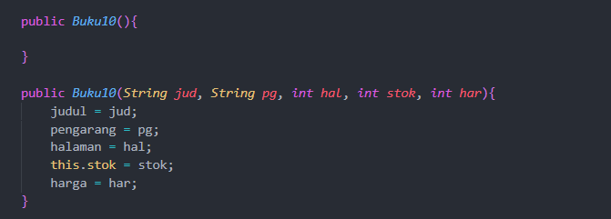
2. class BukuMain10 : 
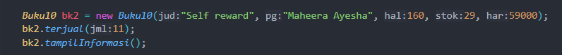
### 2.3.2 **Verifikasi Hasil Percobaan**
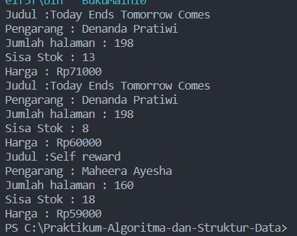
### 2.3.3 **Pertanyaan**
1. Pada class Buku di Percobaan 3, tunjukkan baris kode program yang digunakan untuk 
mendeklarasikan konstruktor berparameter!
Jawaban : 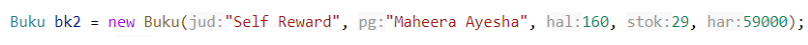
2. Perhatikan class BukuMain. Apa sebenarnya yang dilakukan pada baris program berikut?

Jawaban : Pada baris program tersebut, sebuah objek dari kelas Buku10 dibuat dengan menggunakan konstruktor Buku10 yang menerima lima parameter: judul buku ("Self reward"), nama penulis ("Maheera Ayesha"), jumlah halaman (160), nomor ISBN (29), dan harga buku (59000). Objek yang dibuat disimpan dalam variabel bk2 dengan tipe data Buku10.
3. Hapus konstruktor default pada class Buku, kemudian compile dan run program. Bagaimana 
hasilnya? Jelaskan mengapa hasilnya demikian!
Jawaban : Hasil nya adalah file tidak dapat dikompilasi karena Ketika kita menghapus konstruktor default berarti class Buku10 tidak lagi memiliki konstruktor yang tidak menerima argumen. Namun, class BukuMain10 masih mencoba untuk membuat objek Buku10 tanpa menyediakan argumen untuk konstruktor.
4. Setelah melakukan instansiasi object, apakah method di dalam class Buku harus diakses 
secara berurutan? Jelaskan alasannya!
Jawaban : Tidak, method di dalam class Buku10 tidak harus diakses secara berurutan setelah melakukan instansiasi objek.
5. Buat object baru dengan nama buku<NamaMahasiswa> menggunakan konstruktor 
berparameter dari class Buku!
Jawaban : 
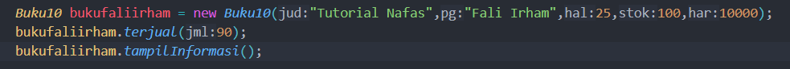

### 2.4 **Latihan Praktikum**
1. Kode Program : 
Class Buku : 
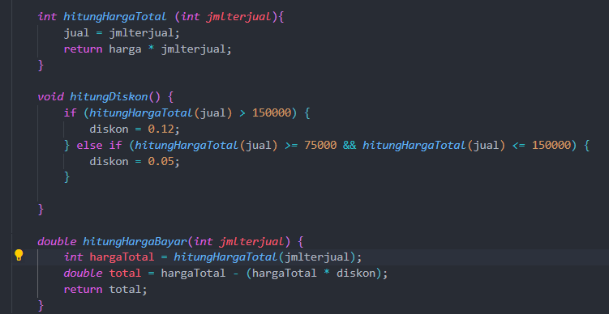
Class Buku Main : 
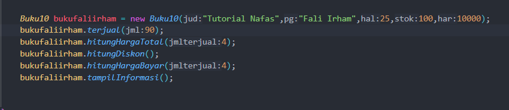
Output : 
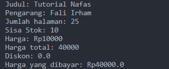
2. Kode Program : 
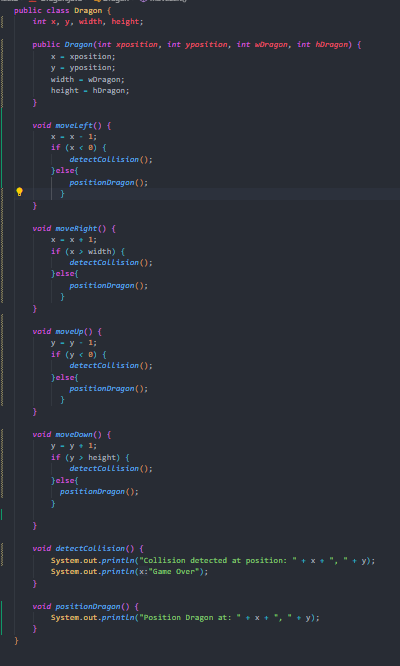
output : 
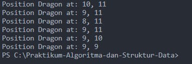
