# **Laporan Jobsheet 3**
---
## Nama    : Fali Irham Maulana
## No      : 10
## Kelas   : 1-H
## NIM     : 2341720121
--- 
### 3.1 **Percobaan 1: Membuat Array dari Object, Mengisi dan Menampilkan** 
Didalam praktikum ini, kita akan mempraktekkan bagaimana membuat array dari object, 
kemudian mengisi dan menampilkan array tersebut.
### 3.1.1 **Kode Program**

- **Class ArrayObjects** 

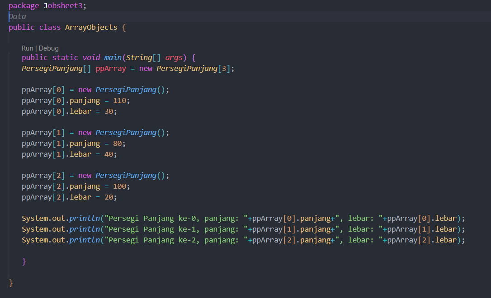

- **Class PersegiPanjang**

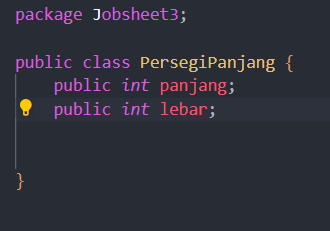
---
### 3.1.2 **Verifikasi Hasil Percobaan**
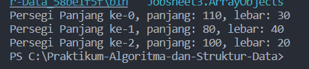
---
### 3.1.3 **Pertanyaan**
1. Berdasarkan uji coba 3.2, apakah class yang akan dibuat array of object harus selalu memiliki 
atribut dan sekaligus method?Jelaskan!

_Jawaban_ : Tidak, class yang akan dibuat sebagai array of objects tidak harus selalu memiliki atribut dan method. Dalam contoh, class PersegiPanjang tidak memiliki method dan hanya memiliki dua atribut panjang dan lebar.

2. Apakah class PersegiPanjang memiliki konstruktor?Jika tidak, kenapa dilakukan pemanggilan 
konstruktur pada baris program berikut :

`ppArray[1]=new PersegiPanjang()`

_Jawaban_ : Class PersegiPanjang tidak memiliki konstruktor yang didefinisikan, Pemanggilan konstruktor yang terjadi pada kode program `ppArray[1]=new PersegiPanjang();` adalah pemanggilan konstruktor default yang bertujuan untuk membuat objek baru dari class PersegiPanjang untuk setiap elemen array. Pada saat objek dibuat, program akan menginisialisasi objek dengan nilai default untuk tipe data yang sesuai.

3. Apa yang dimaksud dengan kode berikut ini:

`PersegiPanjang[] ppArray = new PersegiPanjang[3];`

_Jawaban_ : Kode `PersegiPanjang[] ppArray = new PersegiPanjang[3];` merupakan deklarasi dan inisialisasi sebuah array dari objek-objek PersegiPanjang.

4. Apa yang dimaksud dengan kode berikut ini : 

`ppArray[1]=new PersegiPanjang();`

`ppArray[1].panjang = 80;`

`ppArray[1].lebar = 40;`

_Jawaban_ : Kode tersebut membuat sebuah objek PersegiPanjang baru, kemudian memberi nilai panjangnya menjadi 80 dan lebarnya menjadi 40. Objek tersebut kemudian disimpan di dalam array ppArray pada indeks kedua.

5. Mengapa class main dan juga class PersegiPanjang dipisahkan pada uji coba 3.2.

_Jawaban_ : Karena Class Persegi panjang ditujukan untuk pembuatan constructor objek pada Class Main

### 3.2 **Percobaan 2: Menerima Input Isian Array Menggunakan Looping**
Pada praktikum ini kita akan mengubah hasil program dari praktikum 3.2 sehingga program dapat 
menerima input dan menggunakan looping untuk mengisikan atribut dari semua persegi panjang yang 
ada di ppArray.
### 3.2.1 **Kode Program**
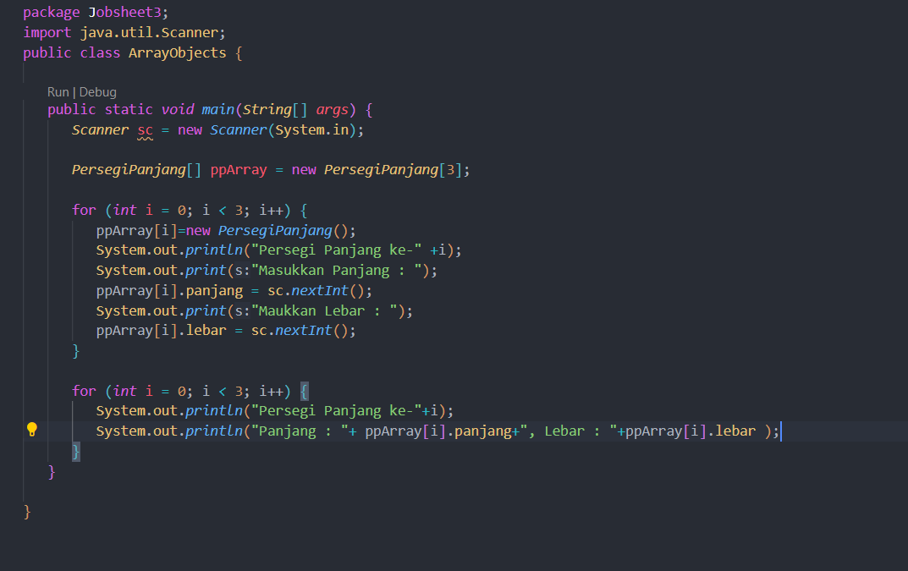
---
### 3.2.2 **Verifikasi Hasil Percobaan**
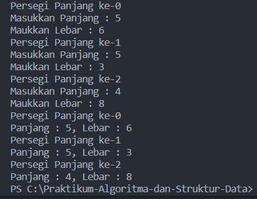
---
### 3.2.3 **Pertanyaan**
1. Apakah array of object dapat diimplementasikan pada array 2 Dimensi?

_Jawaban_ : Ya, array of object dapat diimplementasikan dalam array dua dimensi.

2. Jika jawaban soal no satu iya, berikan contohnya! Jika tidak, jelaskan!

_Jawaban_ : 

Contoh Kode program : 

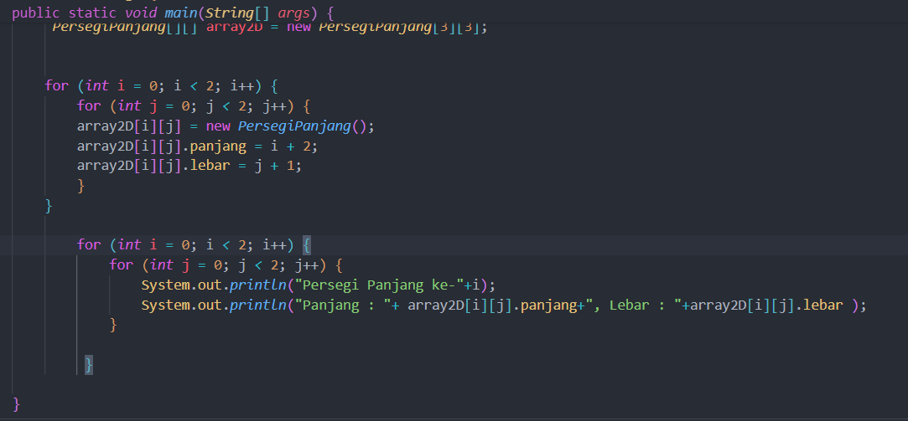

output :

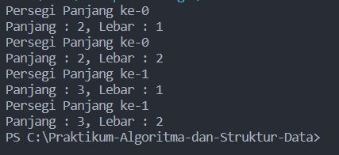

3. Jika diketahui terdapat class Persegi yang memiliki atribut sisi bertipe integer, maka kode 
dibawah ini akan memunculkan error saat dijalankan. Mengapa?

`Persegi [] pgArray = new Persegi[100];`
      `pgArray[5].sisi = 20;`

_Jawaban_ : Kode tersebut error karena program mencoba mengakses atribut sisi dari objek Persegi pada indeks ke-5 dari array pgArray, namun inisialisasi array objek-objek Persegi tidak dibuat.
4. Modifikasi kode program pada praktikum 3.3 agar length array menjadi inputan dengan Scanner!

_Jawaban_ : 

Kode Prgram : 

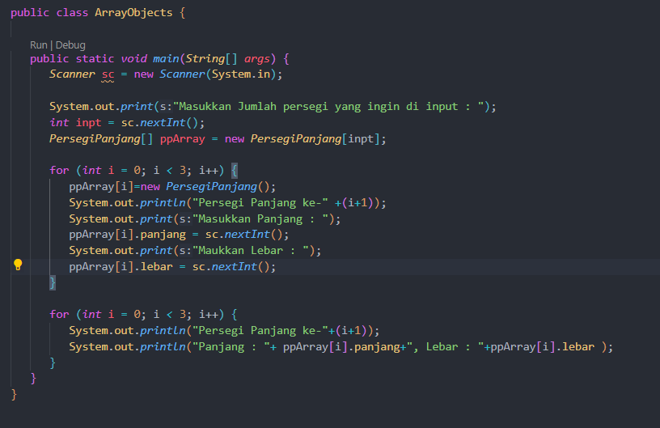

Output : 

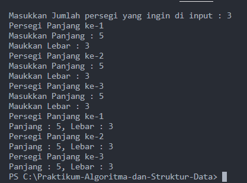

5. Apakah boleh Jika terjadi duplikasi instansiasi array of objek, misalkan saja instansiasi dilakukan 
pada ppArray[i] sekaligus ppArray[0]?Jelaskan !

_Jawaban_ : Ya, Kita dapat melakukan duplikasi instansiasi objek pada array of object, Namun, ini akan menyebabkan kedua elemen array tersebut merujuk pada objek yang sama 

Contoh : ppArray[i] = ppArray[0], membuat kedua elemen array ppArray[i] dan ppArray[0] menunjuk pada objek yang sama.

### 3.3 **Percobaan 3: Penambahan Operasi Matematika di Dalam Method**
Pada praktikum ini kita akan melakukan pengoperasian matematika beberapa atribut pada 
masing-masing anggota array.
### 3.3.1 **Kode Program**

- **Class ArrayBalok**

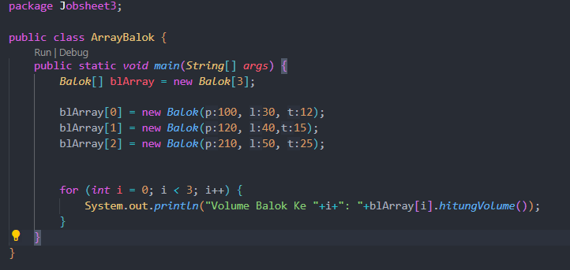

- **Class Balok**

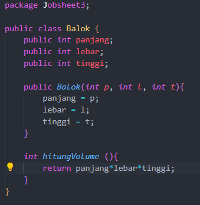
---
### 3.3.2 **Verifikasi Hasil Percobaan**
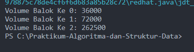
---
### 3.3.3 **Pertanyaan** 
1. Dapatkah konstruktor berjumlah lebih dalam satu kelas? Jelaskan dengan contoh!

_Jawaban_ : Ya, sebuah kelas dapat memiliki lebih dari satu konstruktor.

Contoh : 

_Class Balok_ :

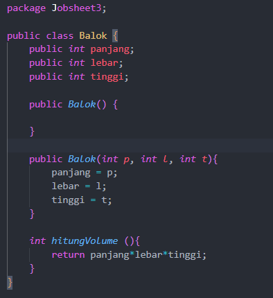

_Class Array Balok_ : 

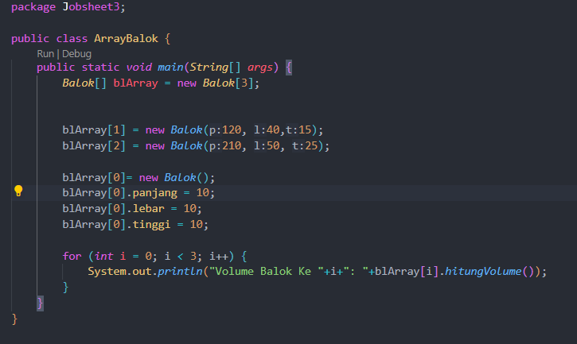

Output : 

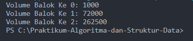

Dalam contoh di atas, Class Balok memiliki dua konstruktor: satu tanpa parameter dan yang lainnya dengan tiga parameter, Konstruktor tanpa parameter digunakan untuk membuat objek Balok dengan nilai default untuk atribut-atributnya. Sedangkan konstruktor kedua digunakan untuk membuat objek Balok dengan nilai yang diberikan oleh pengguna.

2. Jika diketahui terdapat class Segitiga seperti berikut ini:

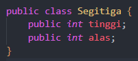

Tambahkan konstruktor pada class Segitiga tersebut yang berisi parameter int a, int t
yang masing-masing digunakan untuk mengisikan atribut alas dan tinggi.

_Jawaban_ : 

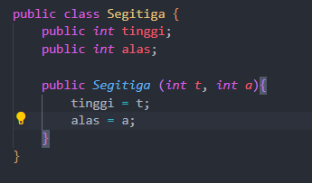

3.  Tambahkan method hitungLuas() dan hitungKeliling() pada class Segitiga tersebut. Asumsi segitiga adalah segitiga siku-siku. (Hint: Anda dapat menggunakan bantuan 
library Math pada Java untuk mengkalkulasi sisi miring).
4. Pada fungsi main, buat array Segitiga sgArray yang berisi 4 elemen, isikan masing-masing 
atributnya sebagai berikut:

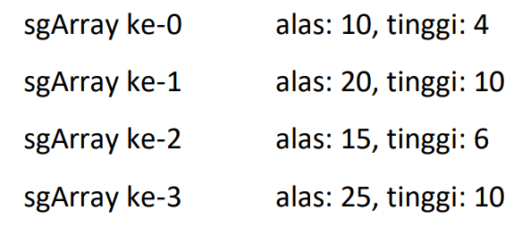

5. Kemudian menggunakan looping, cetak luas dan keliling dengan cara memanggil method 
hitungLuas() dan hitungKeliling().

_Jawaban no3,4,5_ : 

_ **Class Segitiga** :

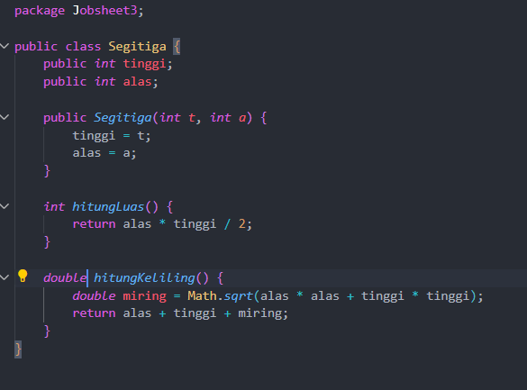

- **Class MainSegitiga** :

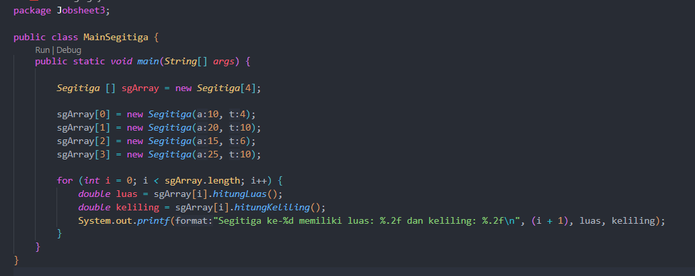

- **Output** : 

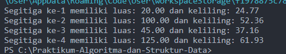

### 3.4 **Latihan Praktikum**
1. Buatlah program yang dapat menghitung luas permukaan dan volume bangun ruang kerucut, 
limas segi empat sama sisi, dan bola. Buatlah 3 (tiga) class sesuai dengan jumlah jenis bangun 
ruang. Buatlah satu main class untuk membuat array of objects yang menginputkan atribut-atribut yang ada menggunakan konstruktor semua bangun ruang tersebut. Dengan ketentuan,

a. Buat looping untuk menginputkan masing-masing atributnya, kemudian tampilkan 
luas permukaan dan volume dari tiap jenis bangun ruang tersebut.

b. Pada kerucut, inputan untuk atribut hanya jari-jari dan sisi miring.

c. Pada limas segi empat sama sisi, inputan untuk atribut hanya panjang sisi alas dan 
tinggi limas.

d. Pada bola, inpuntan untuk atribut hanya jari-jari.

_Jawaban_ : 

- **class Kerucut**

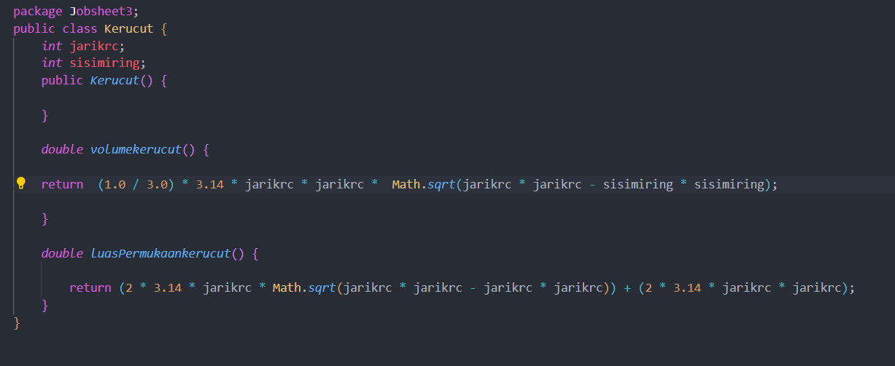

- **class Limas Segi Empat Sama Sisi**

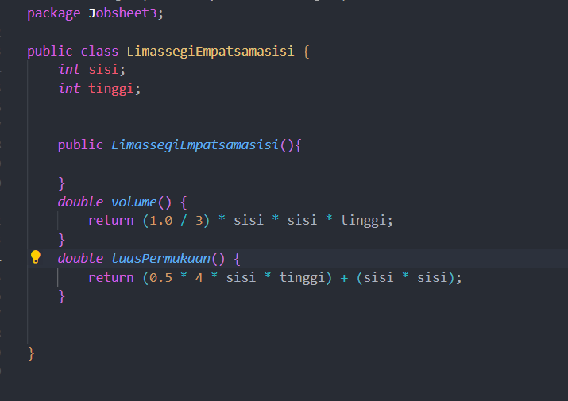

- **class Bola**

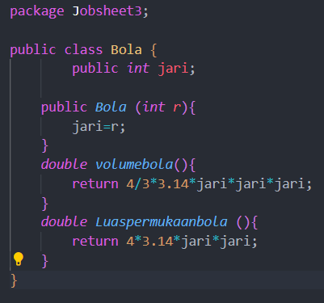

- **Main Bangun Ruang**

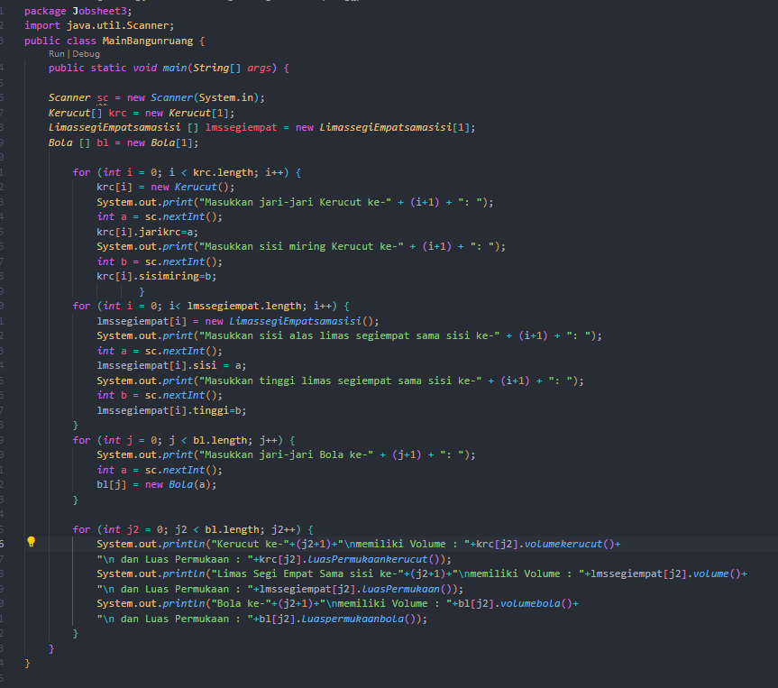

- **Out Put**

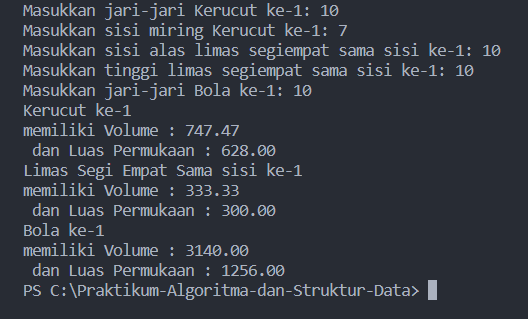

2. Sebuah kampus membutuhkan program untuk menampilkan informasi mahasiswa berupa nama, 
nim, jenis kelamin dan juga IPK mahasiswa. Program dapat menerima input semua informasi 
tersebut, kemudian menampilkanya kembali ke user. Implementasikan program tersebut jika 
dimisalkan terdapat 3 data mahasiswa yang tersedia. Contoh output program: 

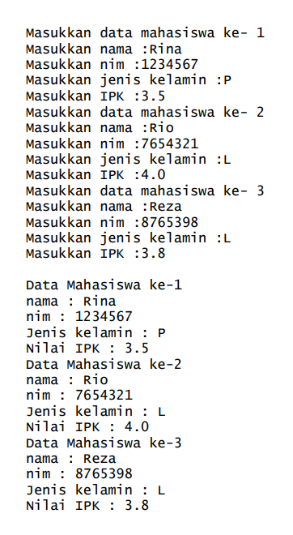

_Jawaban_ : 

- **Class Mahasiswa**

Kode Program : 

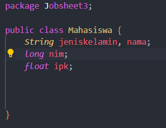

- **Main Mahasiswa**

Kode Program : 

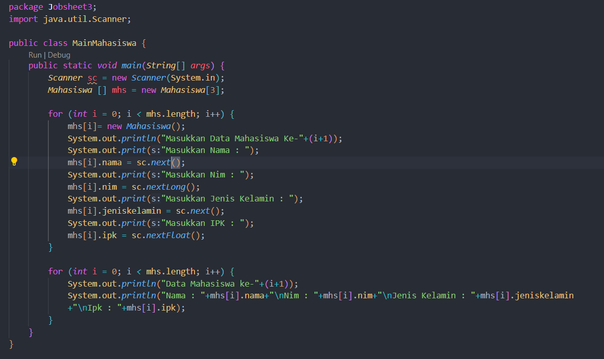

-**Output**

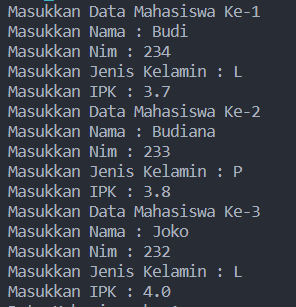
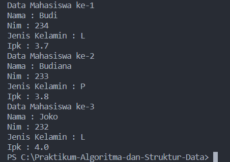

3. Modifikasi program Latihan no.2 di atas, sehingga bisa digunakan untuk menghitung rata-rata IPK, 
serta menampilkan data mahasiswa dengan IPK terbesar! (gunakan method untuk masing-masing 
proses tersebut:).

_Jawaban_ :

- **Kode Program**

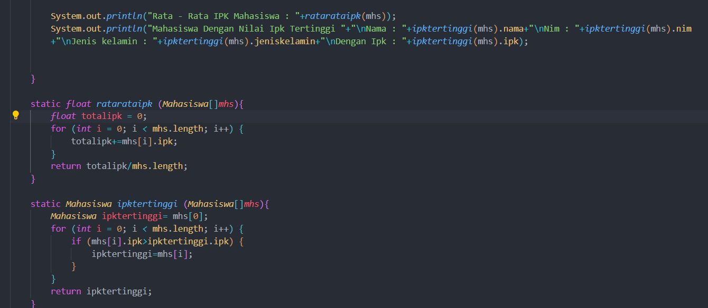

-**OutPut**

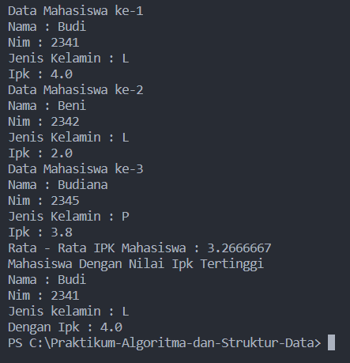 

