# **Laporan Jobsheet 4**
---
## Nama    : Fali Irham Maulana
## No      : 10
## Kelas   : 1-H
## NIM     : 2341720121

# 4.1 Tujuan Praktikum 
Setelah melakukan materi praktikum ini, mahasiswa mampu:

1. Mahasiswa mampu membuat algoritma bruteforce dan divide-conquer

2. Mahasiswa mampu menerapkan penggunaan algorima bruteforce dan divide-conquer

----------------
# 4.2 Menghitung Nilai Faktorial dengan Algoritma Brute Force dan Divide and Conquer

**Kode Program :**

**Faktorial Class** : 

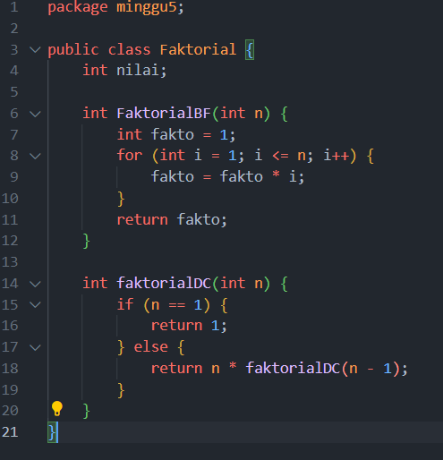

**MainFaktorial Class** : 

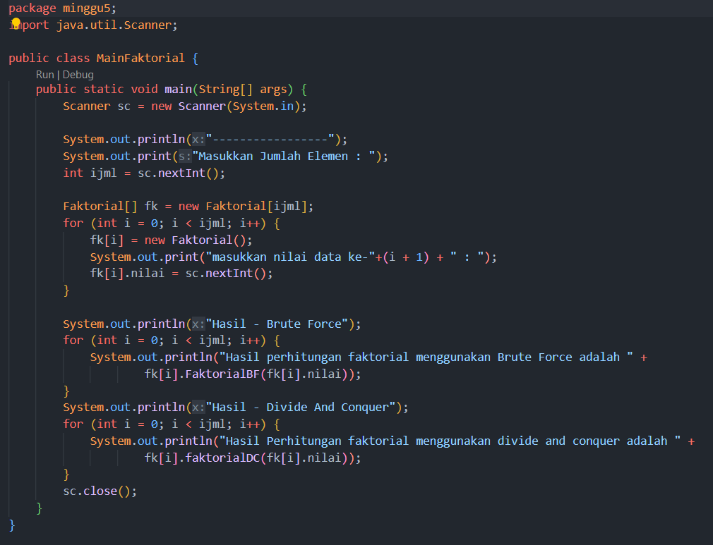

# 4.2.1 Verifikasi Hasil Percobaan 
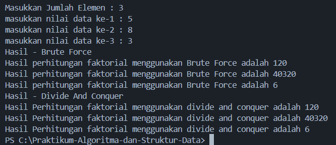
--------------
# 4.2.3 Pertanyaan

1. Pada base line Algoritma Divide Conquer untuk melakukan pencarian nilai faktorial, jelaskan 
perbedaan bagian kode pada penggunaan if dan else!

_Jawaban :_  Pada metode faktorialDC, penggunaan if dan else digunakan untuk mengimplementasikan konsep rekursi. Jika nilai n adalah 1, maka fungsi akan mengembalikan 1 sebagai hasilnya. Jika tidak, maka fungsi akan memanggil dirinya sendiri dengan nilai n-1 dan mengalikan nilai n dengan hasil rekursif tersebut. Penggunaan if digunakan untuk menentukan kondisi basis (base case) dari rekursi, sedangkan else digunakan untuk melakukan langkah rekursif. 

2. Apakah memungkinkan perulangan pada method faktorialBF() dirubah selain menggunakan 
for?Buktikan!

_Jawaban :_ Ya, Kita bisa menggunakan perulangan dalam metode faktorialBF() selain menggunakan for. Anda dapat menggunakan perulangan while atau do-while.

3. Jelaskan perbedaan antara `fakto *= i;` dan `int fakto = n * faktorialDC(n-1);` !

_Jawaban :_ Pada `fakto *= i;`, itu merupakan shorthand notation untuk `fakto = fakto * i;`, yang mengalikan nilai `fakto` dengan `i` dan menyimpan hasilnya kembali ke `fakto`. Sementara itu, `int fakto = n * faktorialDC(n-1);` menginisialisasi `fakto` dengan hasil perkalian `n` dan rekursi dari `faktorialDC(n-1)`, langkah rekursif untuk menghitung faktorial `n`.

---------------
# 4.3 Menghitung Hasil Pangkat dengan Algoritma Brute Force dan Divide and Conquer
Pada praktikum ini kita akan membuat program class dalam Java. Untuk menghitung nilai pangkat 
suatu angka menggunakan 2 jenis algoritma, Brute Force dan Divide and Conquer. 

**Kode Program :** 

**pangkat Class** : 

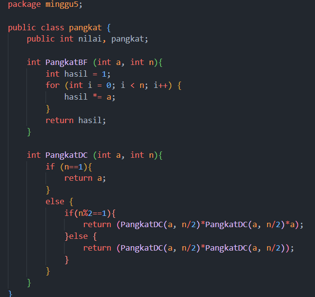

**Mainpangkat Class** : 

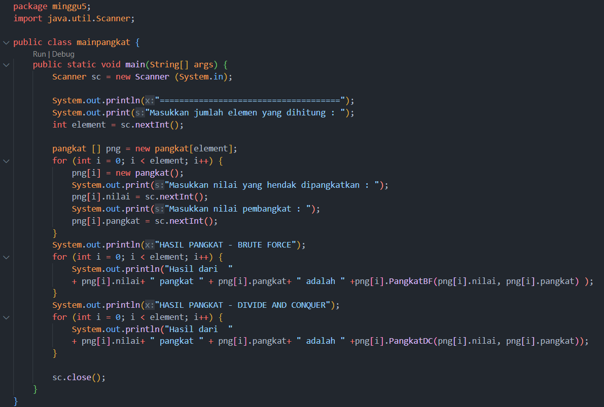
---------------
# 4.3.1 Verifikasi Hasil Percobaan 
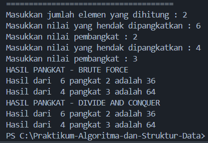
----------------
# 4.3.2 Pertanyaan 

1. Jelaskan mengenai perbedaan 2 method yang dibuat yaitu PangkatBF() dan PangkatDC()!

_Jawaban :_

- Metode PangkatBF() menggunakan pendekatan brute force dengan melakukan iterasi sebanyak n kali untuk menghitung hasil pangkat dari a dengan eksponen n.

- Metode PangkatDC() menggunakan pendekatan divide and conquer dengan membagi masalah menjadi submasalah yang lebih kecil. Jika eksponen n ganjil, metode ini membagi eksponen menjadi n/2 dan menggunakan rekursi untuk menghitung pangkat dengan lebih efisien.

2. Apakah tahap combine sudah termasuk dalam kode tersebut?Tunjukkan!

_Jawaban :_ Tahap combine sudah termasuk pada metode PangkatDC() terjadi melalui operasi penggabungan hasil pangkat dari submasalah yang lebih kecil. Pada bagian if (n%2==1), hasil pangkat dari submasalah digabungkan dengan a untuk mendapatkan hasil akhir yang benar.

3. Modifikasi kode program tersebut, anggap proses pengisian atribut dilakukan dengan 
konstruktor.

_Jawaban :_ 

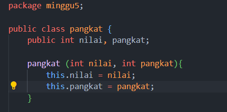

4. Tambahkan menu agar salah satu method yang terpilih saja yang akan dijalankan menggunakan 
switch-case!

_Jawaban :_ 

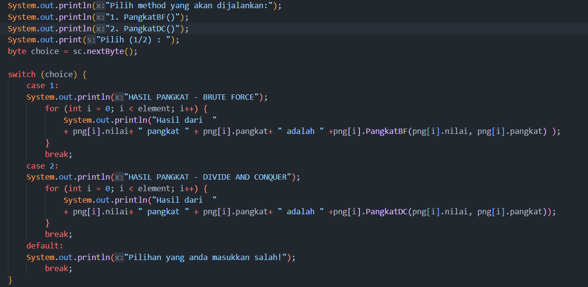

_Output :_

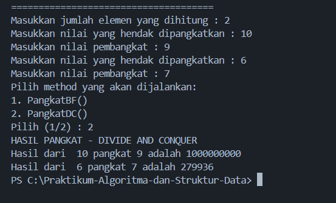

---------------------
# 4.4  Menghitung Sum Array dengan Algoritma Brute Force dan Divide and Conquer
Di dalam percobaan ini, kita akan mempraktekkan bagaimana proses divide, conquer, dan 
combine diterapkan pada studi kasus penjumlahan keuntungan suatu perusahaan dalam beberapa 
bulan.

**Kode Program :** 

**sum Class** : 

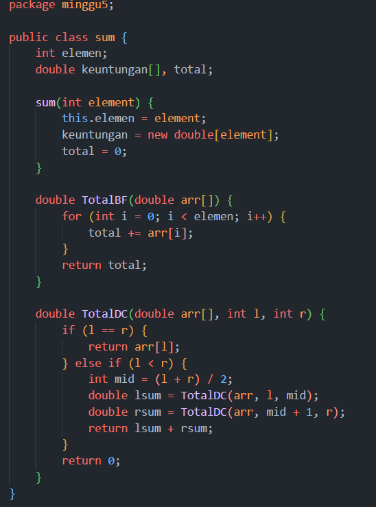

**mainsum Class** : 

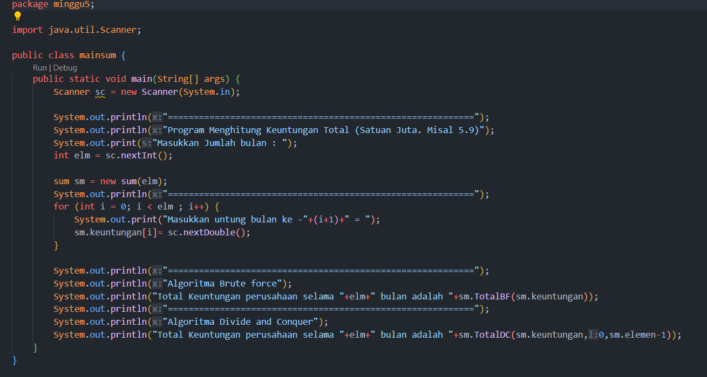

------------------
# 4.4.1 Verfikasi Hasil Percobaan 
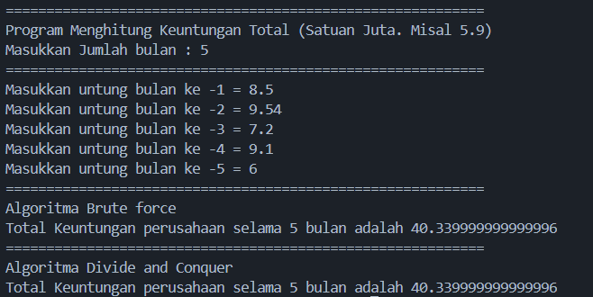

------------------
# 4.4.2 Pertanyaan

1. Mengapa terdapat formulasi return value berikut?Jelaskan!

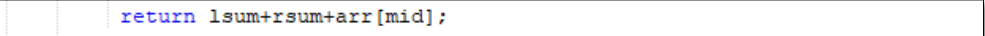

_Jawaban :_ Formulasi ini digunakan untuk menggabungkan nilai lsum, rsum, dan elemen tengah arr[mid] saat melakukan rekursi dalam algoritma divide and conquer. Ketika membagi array menjadi dua bagian, nilai tengah arr[mid] ditambahkan ke hasil akhir sebagai bagian dari proses penggabungan hasil submasalah.

2. Kenapa dibutuhkan variable mid pada method TotalDC()?

_Jawaban :_ Variabel mid digunakan untuk menandai posisi tengah dari subarray saat membagi array menjadi dua bagian dalam algoritma divide and conquer. Hal ini memungkinkan kita untuk membagi masalah menjadi submasalah yang lebih kecil, yaitu dari indeks l hingga mid dan dari indeks mid + 1 hingga r.

3. Program perhitungan keuntungan suatu perusahaan ini hanya untuk satu perusahaan saja. 
Bagaimana cara menghitung sekaligus keuntungan beberapa bulan untuk beberapa 
perusahaan.(Setiap perusahaan bisa saja memiliki jumlah bulan berbeda-beda)? Buktikan 
dengan program!

_Jawaban :_ 

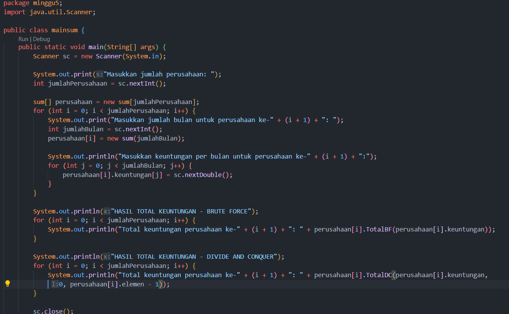

_Output Kode Program:_

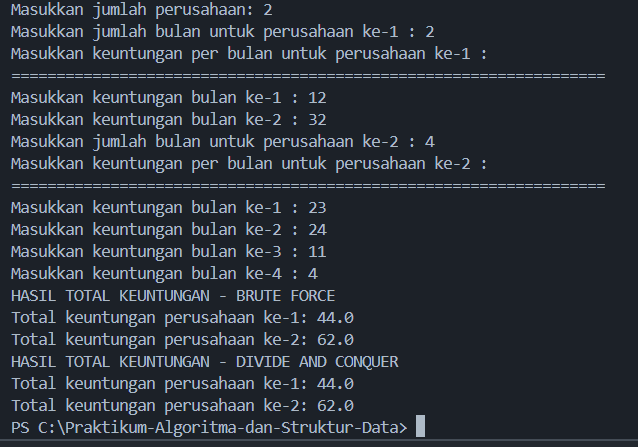

# 4.5 Latihan Praktikum 

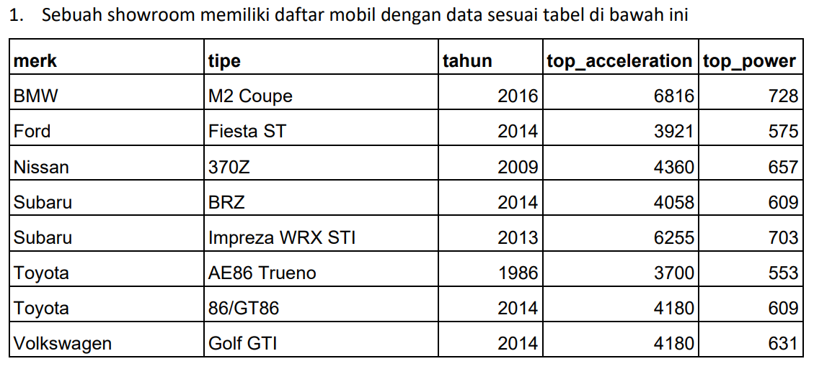

**Tentukan:**

a) top_acceleration tertinggi menggunakan Divide and Conquer!

b) top_acceleration terendah menggunakan Divide and Conquer!

c) Rata-rata top_power dari seluruh mobil menggunakan Brute Force

_Jawaban :_

_Kode Program :_

**Cars Class :**

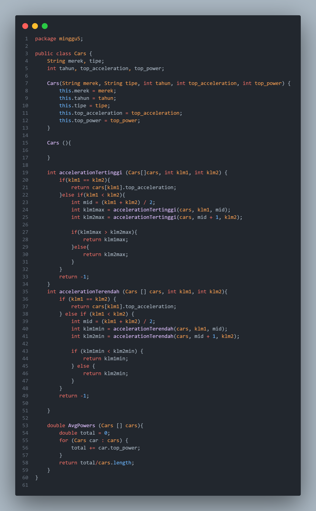

**MainCar Class:**

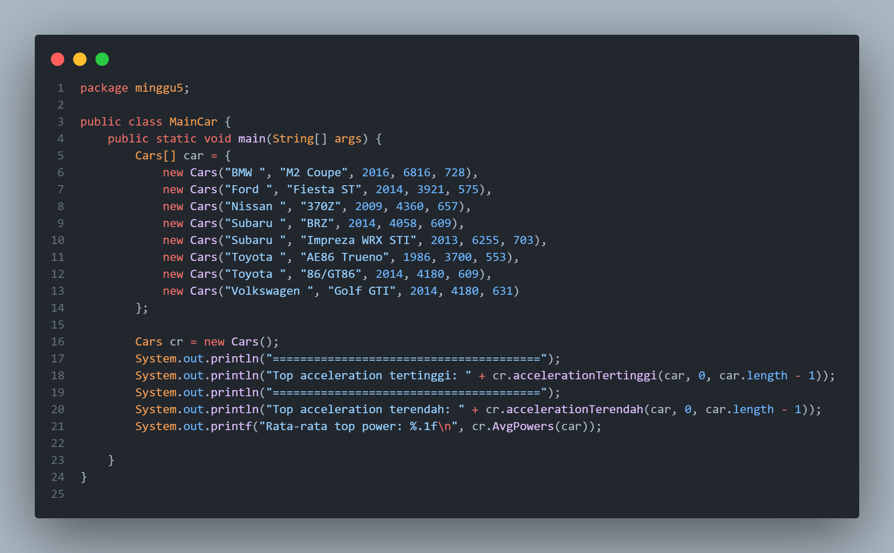

**Output :**

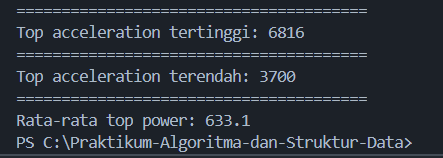

