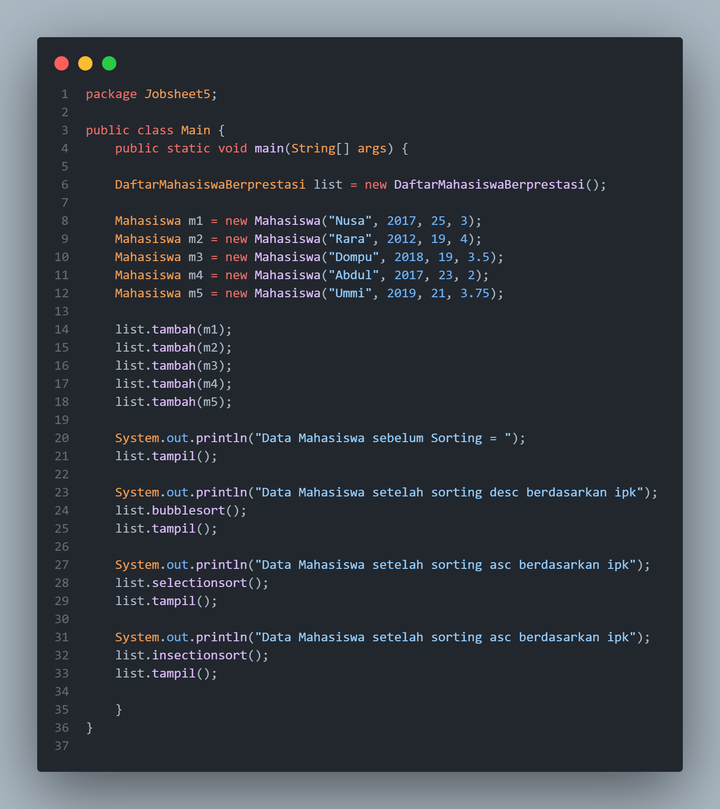

# **Laporan Jobsheet 5**
---
## Nama    : Fali Irham Maulana
## No      : 10
## Kelas   : 1-H
## NIM     : 2341720121

### 5.1 Tujuan Praktikum 
Setelah melakukan praktikum ini diharapkan mahasiswa mampu:

a. Mahasiswa mampu membuat algoritma searching bubble sort, selection sort dan 
insertion sort

b. Mahasiswa mampu menerapkan algoritma searching bubble sort, selection sort 
dan insertion sort pada program
-----------------
### 5.2 Mengurutkan Data Mahasiswa Berdasarkan IPK Menggunakan Bubble Sort
**Kode Program :** 

- **Mahasiswa Class :**

- **DaftarMahasiswaBerprestasi Class:**

- **Main Class :**

------------------
### 5.2.1 Verifikasi Hasil percobnaan
_Sebelum Sorting :_

_Setelah Sorting :_

 

----------------------
### 5.2.2 Pertanyaan 

1. Terdapat di method apakah proses bubble sort? 

_Jawaban :_ terdapat pada method bublesort pada Class DaftarMahasiswaBerprestasi 

2.  Di dalam method bubbleSort(), terdapat baris program seperti di bawah ini:

Untuk apakah proses tersebut?

_Jawaban :_ 
Proses tersebut bertujuan untuk pengurutan menggunakan algoritma Bubble Sort dengan cara membandingkan dua elemen adjacent dalam suatu list dan menukar posisi mereka jika diperlukan sehingga elemen-elemen yang lebih kecil akan bergerak ke arah akhir list secara berurutan. Proses ini terus diulang sampai seluruh list terurut.

3. Perhatikan perulangan di dalam bubbleSort() di bawah ini: 

a. Apakah perbedaan antara kegunaan perulangan i dan perulangan j? 

_Jawaban :_ Perbedaan antara perulangan i dan j dimana perulangan i digunakan untuk mengontrol jumlah iterasi keseluruhan dari awal hingga akhir list. Sedangkan perulangan j digunakan untuk membandingkan dan menukar elemen-elemen adjacent dalam list.

b. Mengapa syarat dari perulangan i adalah `i<listMhs.length-1` ?

_Jawaban :_ Karena pada iterasi terakhir elemen terakhir sudah pasti berada di posisi yang tepat setelah iterasi sebelumnya, maka tidak perlu dilakukan iterasi lagi setelah i mencapai listMhs.length - 1.

c. Mengapa syarat dari perulangan j adalah `j<listMhs.length-i` ?

_Jawaban :_ untuk membatasi iterasi j agar tidak memeriksa kembali elemen yang sudah terurut di bagian belakang array.

d. Jika banyak data di dalam listMhs adalah 50, maka berapakali perulangan i akan 
berlangsung? Dan ada berapa Tahap bubble sort yang ditempuh?

_Jawaban :_  jika banyak data dalam listMhs adalah 50, maka jumlah perulangan i pada algoritma bubblesort adalah 49 kali. serta tahap bubblesort yang ditempuh sebanyak 49 kali sesuai dengan jumlah iterasi pada perulangan luar (i), dimana mencakup pergeseran elemen-elemen besar ke bagian belakang array hingga semua elemen terurut.
------------------
### 5.3 Mengurutkan Data Mahasiswa Berdasarkan IPK Menggunakan Selection Sort
**KodeProgram :** 

- **Mahasiswa Class :**

- **DaftarMahasiswaBerprestasi Class:**

- **Main Class :**

------------------
### 5.3.1 Verifikasi Hasil Percobaan
_Sebelum Sorting :_

_Setelah Sorting :_

----------------------
### 5.3.2 Pertabnyaan 
Di dalam method selection sort, terdapat baris program seperti di bawah ini:

Untuk apakah proses tersebut, jelaskan!

_Jawaban :_ Proses tersebut adalah bagian dari algoritma selection sort yang bertujuan untuk mencari elemen terkecil dalam array. Langkahnya dimulai dengan menginisialisasi idxmin dengan nilai i, kemudian dilakukan perulangan untuk mencari elemen terkecil dari indeks i+1 hingga akhir array. Jika ditemukan elemen yang lebih kecil, maka idxmin diupdate dengan nilai indeks elemen terkecil tersebut. Setelah proses pencarian selesai, dilakukan pertukaran elemen antara indeks i dengan idxmin, sehingga elemen terkecil dipindahkan ke posisi yang benar dalam array.
--------------------
### 5.4 Mengurutkan Data Mahasiswa Berdasarkan IPK Menggunakan Insertion Sort
**Kode Program :** 

- **Mahasiswa Class :**

- **DaftarMahasiswaBerprestasi Class:**

- **Main Class :**

------------------
### 5.4.1 Verifikasi Hasil Percobaan 
_Sebelum Sorting :_

_Setelah Sorting :_

----------------------
### 5.4.2 Pertanyaan
Ubahlah fungsi pada InsertionSort sehingga fungsi ini dapat melaksanakan proses sorting 
dengan cara descending

_Jawaban :_

**Kode Program Yang di ubah :**  

**Output :**

--------------------
### 5.5 Latihan praktikum 

**Kode Program :** 

- **Hotel Class :**

- **Hotel Service Class:**

- **MainHotel Class :**

- **Output :**

**Sebelum Sorting** 

1. _Mengurutkan Bintang :_

- _Bubble Sort :_

- _Selection Sort :_

2. _Mengurutkan Harga:_

- _Bubble Sort :_

- _Selection Sort :_

------------------