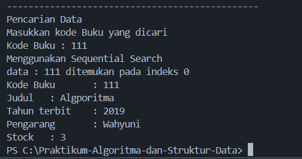
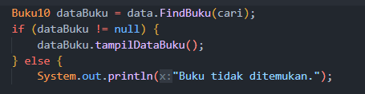
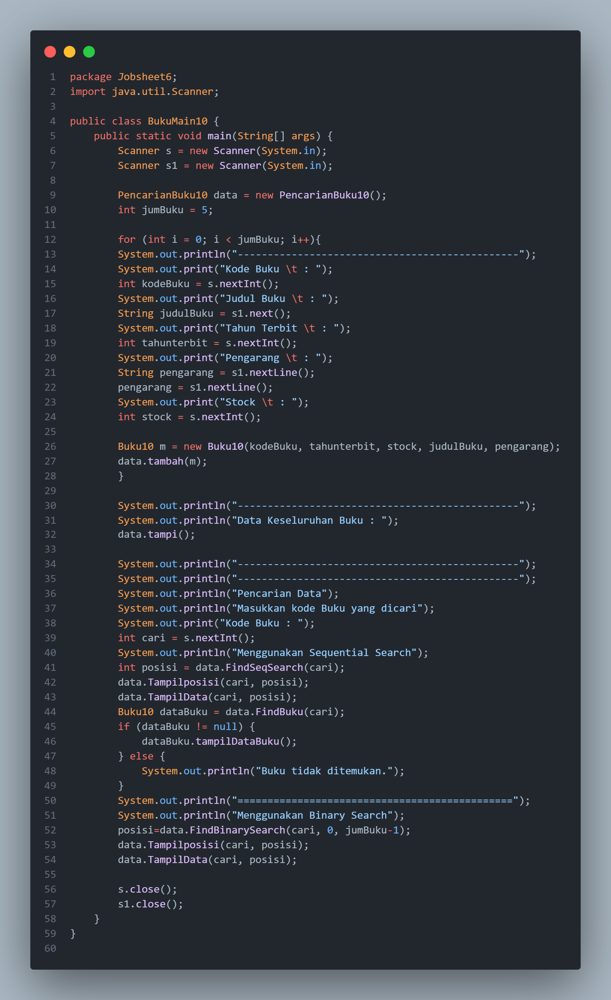

# **Laporan Jobsheet 6**
---
## Nama    : Fali Irham Maulana
## No      : 10
## Kelas   : 1-H
## NIM     : 2341720121

### 6.1 Tujuan Praktikum 
Setelah melakukan materi praktikum ini mahasiswa mampu:
1. Menjelaskan mengenai algoritma Searching.

2. Membuat dan mendeklarasikan struktur algoritma Searching.

3. Menerapkan dan mengimplementasikan algoritma Searching
--------------
### 6.2 Searching / Pencarian Menggunakan Agoritma Sequential Search
**Kode Program :**

- **Buku10 Class :**

- **PencarianBuku10 Class :**

- **BukuMain10 Class :**

------------------------
### 6.2.1  Verifikasi Hasil Percobaan
- _Jika Data Ditemukan :_

- _Jika Data Tidak Ditemukan :_

---------
### 6.2.2 Pertanyaan
1. Jelaskan fungsi `break` yang ada pada method FindSeqSearch!

_Jawaban :_ Fungsi break yang ada pada method FindSeqSearch adalah untuk menghentikan secara paksa proses pencarian saat kondisi yang diinginkan terpenuhi.

2. Jika Data Kode Buku yang dimasukkan tidak terurut dari kecil ke besar. Apakah program masih 
dapat berjalan? Apakah hasil yang dikeluarkan benar? Tunjukkan hasil screenshoot untuk bukti 
dengan kode Buku yang acak. Jelaskan Mengapa hal tersebut bisa terjadi?

_Jawaban :_ meskipun data kode buku tidak diurutkan dari kecil ke besar program akan tetap berjalan dengan benar dan Hasil yang dikeluarkan juga akan benar, karena pencarian sekuensial mencari setiap elemen dalam array hingga menemukan elemen yang dicari atau sampai selesai jika tidak ditemukan. 

_Bukti :_ 

3. Buat method baru dengan nama FindBuku menggunakan konsep sequential search dengan tipe 
method dari FindBuku adalah BukuNoAbsen. Sehingga Anda bisa memanggil method 
tersebut pada class BukuMain seperti gambar berikut :

_Jawaban :_ 

_Kode Program :_

_Output :_

----------------
### 6.3 Searching / Pencarian Menggunakan Binary Search

**Kode Program :**

**Buku10 Class :**

- **PencarianBuku10 Class :**

- **BukuMain10 Class :**

----------------------
### 6.3.1 Verifikasi Hasil Percobaan

-----------------
### 6.3.2 Pertanyaan 
1. Tunjukkan pada kode program yang mana proses divide dijalankan!

_Jawaban :_ Proses divide terjadi pada baris mid = (right + left)/2;, di mana array dibagi menjadi dua bagian yang lebih kecil pada setiap iterasi.

2. Tunjukkan pada kode program yang mana proses conquer dijalankan!

_Jawaban :_ Proses conquer terjadi pada kondisi if(cari == listBK[mid].kodebuku), di mana nilai tengah (mid) dari array dibandingkan dengan nilai yang dicari (cari). Jika nilai tersebut sama, maka proses conquer dijalankan dengan mengembalikan posisi nilai yang ditemukan.

3. Jika data Kode Buku yang dimasukkan tidak urut. Apakah program masih dapat berjalan? Mengapa 
demikian! Tunjukkan hasil screenshoot untuk bukti dengan kode Buku yang acak. Jelaskan 
Mengapa hal tersebut bisa terjadi? 

_Jawaban :_ Jika data Kode Buku tidak diurutkan, maka program tidak akan dapat berjalan dengan benar karena dalam pencarian biner, setiap iterasi membagi array menjadi dua bagian dan membandingkan nilai tengah dengan nilai yang dicari. Jika data tidak diurutkan, nilai tengah tidak akan merepresentasikan nilai yang tepat dalam konteks pencarian biner, sehingga hasil pencarian tidak dapat diandalkan.

_Bukti :_ 

4. Jika Kode Buku yang dimasukkan dari Kode Buku terbesar ke terkecil (missal : 20215, 20214, 
20212, 20211, 20210) dan elemen yang dicari adalah 20210. Bagaimana hasil dari binary search? 
Apakah sesuai? Jika tidak sesuai maka ubahlah kode program binary seach agar hasilnya sesuai!

_Jawaban :_ Hasil dari binary searchnya adalah error dan tidak sesuai. 

_Perubahan :_

_Output :_

---------------------------
### 6.4 Percobaan Pengayaan Divide and Conquer

**Kode Program :** 

**MergeSorting10 Class :**

**MergeSortMain10 Class :**

--------------
### 6.4.1 Verifikasi Hasil Percobaan 

--------------------------
### 6.5 Latihan Praktikum 
1. Modifikasi percobaan searching diatas dengan ketentuan berikut ini

- Ubah tipe data dari kode Buku yang awalnya int menjadi String

- Tambahkan method untuk pencarian kode Buku (bertipe data String) dengan menggunakan 
sequential search dan binary search.

2. Modifikasi percobaan searching diatas dengan ketentuan berikut ini

- Tambahkan method pencarian judul buku menggunakan sequential search dan binary 
search. Sebelum dilakukan searching dengan binary search data harus dilakukan pengurutan 
dengan menggunakan algoritma Sorting (bebas pilih algoritma sorting apapun)! Sehingga 
ketika input data acak, maka algoritma searching akan tetap berjalan

- Buat aturan untuk mendeteksi hasil pencarian judul buku yang lebih dari 1 hasil dalam 
bentuk kalimat peringatan! Pastikan algoritma yang diterapkan sesuai dengan kasus yang 
diberikan
--------------------
### 6.5.1 Jawaban Latihan Prkatikum 

1. **Kode Program :**

- **Buku10 Class :** 

- **PencarianBuku10 Class :**

- **BukuMain10 Class:** 

- **Output :**

2. **Kode Program :**

- **PencarianBuku10 Class :**

- **BukuMain10 Class:** 

- **Output :**

- _Jika Judul Ada Yang sama :_

