# **Laporan Jobsheet 7**
---
## Nama    : Fali Irham Maulana
## No      : 10
## Kelas   : 1-H
## NIM     : 2341720121

### 7.1 Tujuan Praktikum 
Setelah melakukan materi praktikum ini, mahasiswa mampu:

1. Membuat struktur data Stack

2. Menerapkan algoritma Stack ke dalam program
-----------
### 7.2  Percobaan 1: Penyimpanan Tumpukan Barang dalam Gudang

**Kode Program :**

- **Barang10 Class :**

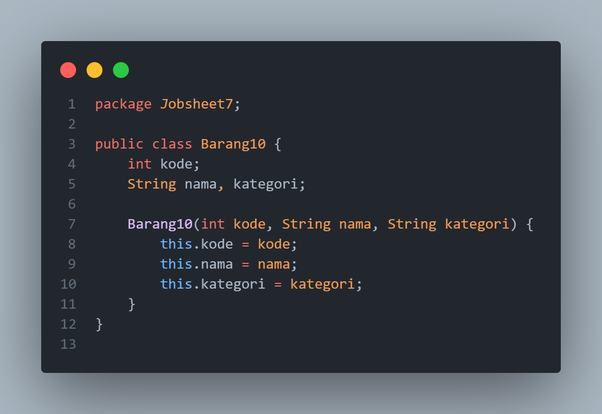

- **Gudang10 Class :**

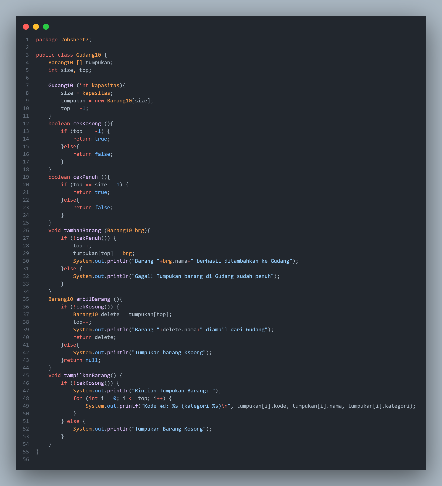

- **Utama10 Class :**

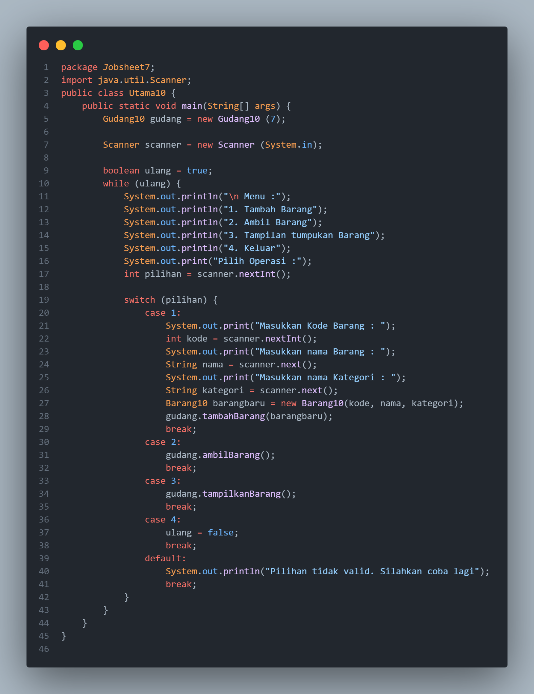
----------------
### 7.2.1.  Verifikasi Hasil Percobaan
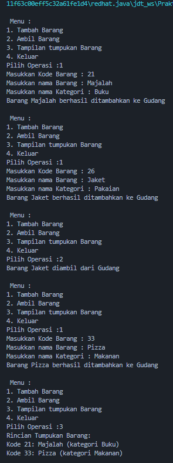
-----------------
### 7.2.2 Pertanyaan
1. Lakukan perbaikan pada kode program, sehingga keluaran yang dihasilkan sama dengan verifikasi 
hasil percobaan! Bagian mana saja yang perlu diperbaiki?

_Jawaban :_ Yang perlu diperbaiki adalah bagian paada metode tampilkanBarang, terdapat kesalahan dalam format string pada printf. Format %f digunakan untuk menampilkan tipe data float, sedangkan nama pada Barang10 bertipekan data string.

2. Berapa banyak data barang yang dapat ditampung di dalam tumpukan? Tunjukkan potongan kode programnya!

_Jawaban :_ data barang yang dapat ditampung di dalam tumpukan sebanyak 7 yang diatur pada kode program berikut :

`Gudang10 gudang = new Gudang10 (7);`

3. Mengapa perlu pengecekan kondisi !cekKosong() pada method tampilkanBarang? Kalau kondisi 
tersebut dihapus, apa dampaknya?

_Jawaban :_ Pengecekan kondisi `!cekKosong()` pada method tampilkanBarang dilakukan untuk memastikan bahwa tumpukan tidak kosong sebelum mencoba menampilkan barang. Jika kondisi tersebut dihapus, maka  program akan mencoba menampilkan barang bahkan ketika tumpukan kosong.

_Contoh_ :

_Method Tampilkan Barang tanpa `!cekKosong()`_ :

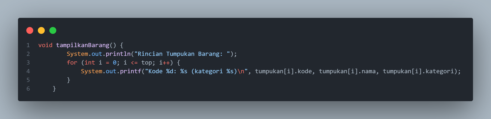

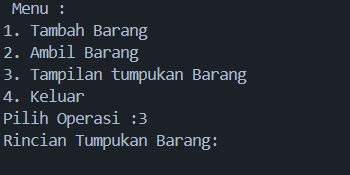

4. Modifikasi kode program pada class Utama sehingga pengguna juga dapat memilih operasi lihat 
barang teratas, serta dapat secara bebas menentukan kapasitas gudang!

_Jawaban :_

- **Utama10 Class :**

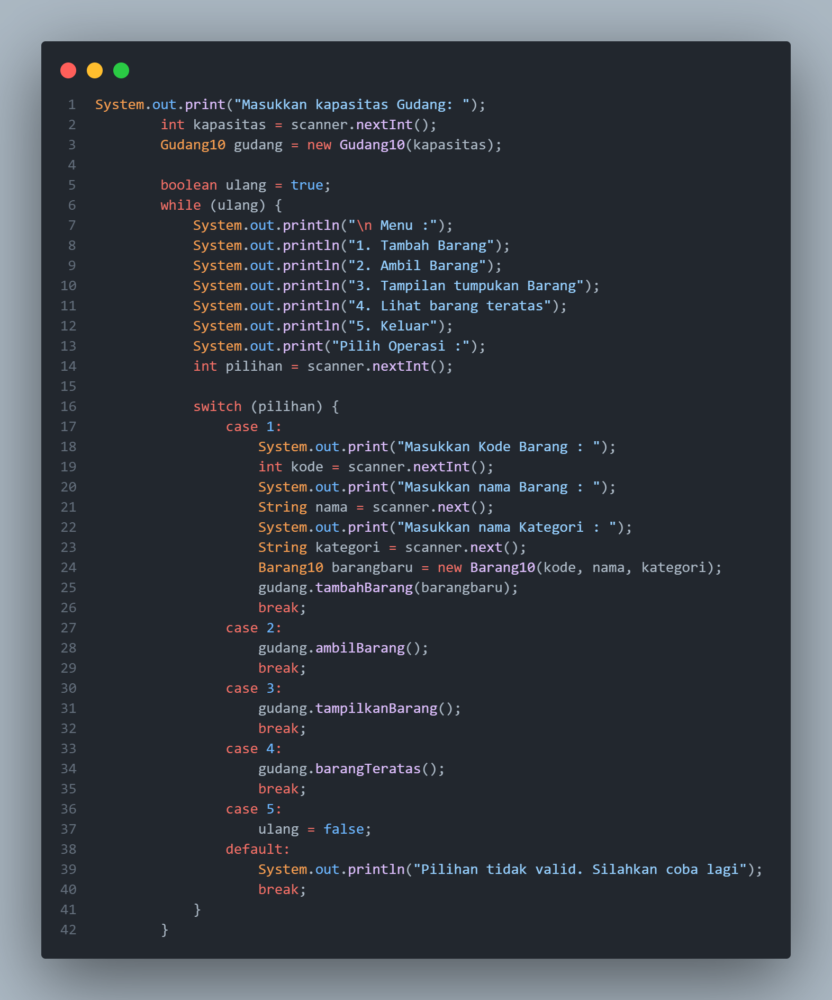

- **Gudang10 Class :**

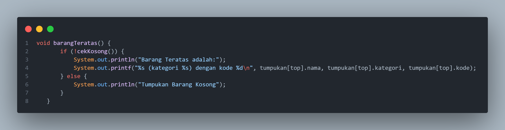

5. Commit dan push kode program ke Github

_Jawaban :_

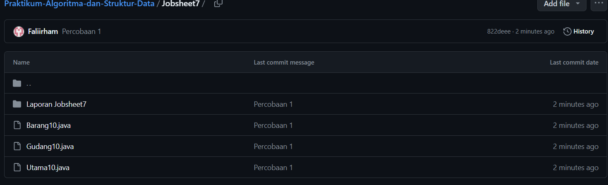
-----------------
### 7.3 Konversi Kode Barang ke Biner
**Kode Program :**

- **Barang10 Class :**

- **Gudang10 Class :**

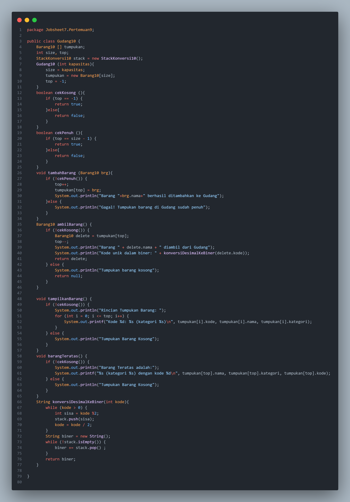

- **StackKonversi10 Class:**

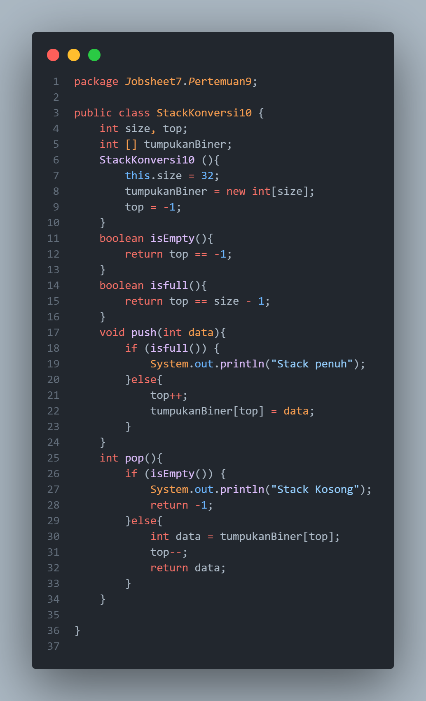

- **Utama10 Class :**

--------------
### 7.3.1 Verifikasi Hasil Percobaan
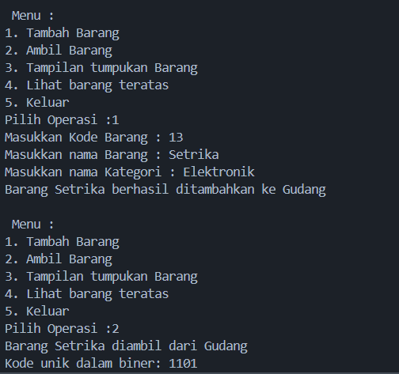
----------------
### 7.3.2 Pertanyaan 

1. Pada method konversiDesimalKeBiner, ubah kondisi perulangan menjadi `while (kode != 0)`, 
bagaimana hasilnya? Jelaskan alasannya!

_Jawaban :_ Setelah diubah menjadi while (kode != 0), perulangan akan dilakukan selama kode tidak sama dengan 0. dan hasilnya pun sama ketika menggunakan `while (kode != 0)`

_Bukti:_

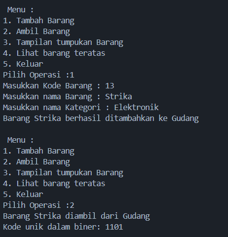

2. Jelaskan alur kerja dari method konversiDesimalKeBiner!

_Jawaban :_ Alur Kerja Method konversiDesimalKeBiner:

- objek StackKonversi10 dibuat untuk menyimpan sisa pembagian bilangan desimal dengan 2, Selama kode tidak sama dengan 0 (while (kode != 0)):

- kemudian menghitung sisa pembagian kode dengan 2 (int sisa = kode % 2).

- lalu memasukkan sisa tersebut ke dalam stack menggunakan metode push. setelah itu membagi kode dengan 2 untuk memperoleh nilai kode baru yang akan digunakan pada iterasi berikutnya.

- Setelah semua sisa pembagian dimasukkan ke dalam stack, lakukan iterasi melalui stack untuk mengambil nilai sisa dan tambahkan ke string biner menggunakan StringBuilder.

- lalu mengembalikan string biner yang berisi representasi biner dari bilangan desimal.
----------------------
### 7.4 Konversi Notasi Infix ke Postfix
**Kode Program :**

- **Postfix10 Class :**

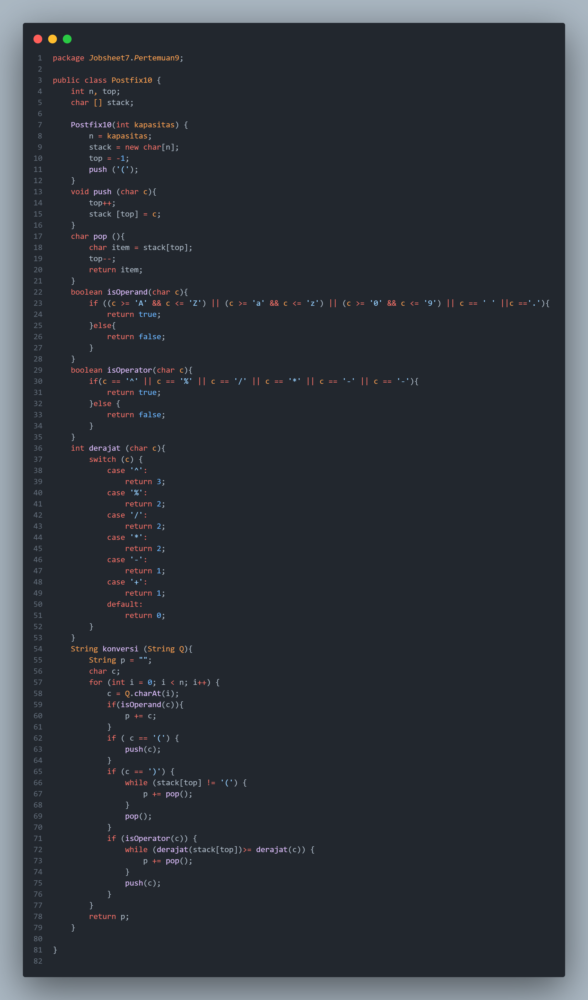

- **PostfixMain10 Class :**

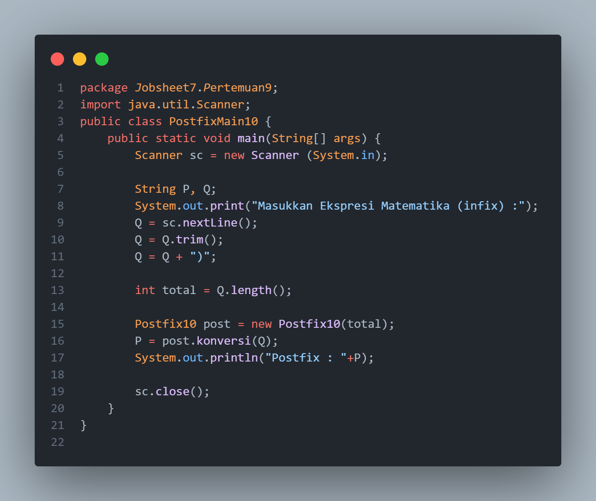
------------------------
### 7.4.1 Verifikasi Hasil Percobaan 

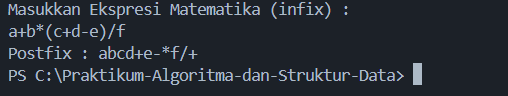
--------------------------
### 7.4.2 Pertanyaan 

1. Pada method derajat, mengapa return value beberapa case bernilai sama? Apabila return 
value diubah dengan nilai berbeda-beda setiap case-nya, apa yang terjadi?

_Jawaban :_ Dalam method derajat, beberapa return value sama karena mereka mewakili prioritas operator dalam ekspresi. Operator dengan prioritas lebih tinggi harus dievaluasi terlebih dahulu. Jika mengubah return value menjadi angka yang berbeda untuk setiap kasus, urutan prioritas dalam mengevaluasi operator akan terganggu. misal kita memberikan nreturn value  yang lebih tinggi untuk + daripada -, algoritma kode program akan memprioritaskan penjumlahan daripada pengurangan, yang tidak benar dalam prioritas matematika.

_Contoh :_
**Sebelum Perubahan return value `'+'` > `'-'` :**

**Setelah Perubahan return value `'+'` > `'-'` :**

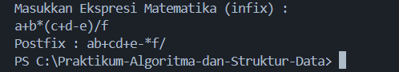

2. Jelaskan alur kerja method konversi!

_Jawaban :_

- Method konversi mengubah ekspresi infix menjadi ekspresi postfix menggunakan stack, serta menginisialisasi string kosong p untuk menyimpan ekspresi postfix.

- Method melakukan looping untuk setiap karakter dalam ekspresi infix Q.

- Jika karakter adalah operand (huruf, digit, spasi, atau titik), karakter tersebut langsung ditambahkan ke string postfix p.

- Jika karakter adalah tanda kurung buka (, ia dipush ke stack.

- Jika karakter adalah tanda kurung tutup ), operator-oprator dipop dari stack dan ditambahkan ke p sampai menemukan tanda kurung buka.

- Jika karakter adalah operator (^, %, /, *, -, +), ia membandingkan prioritasnya dengan operator teratas di stack.

- Jika prioritas operator saat ini lebih rendah atau sama dengan operator teratas di stack, operator teratas dipop dan ditambahkan ke p. Proses ini terus berlanjut sampai stack kosong atau operator teratas memiliki prioritas yang lebih rendah. Kemudian, operator saat ini dipush ke stack.

- Setelah semua karakter dalam Q diproses, operator-operator yang tersisa di stack dipop dan ditambahkan ke p untuk melengkapi ekspresi postfix.

- Method mereturn value postfix p.

3. Pada method konversi, apa fungsi dari potongan kode berikut?

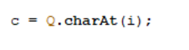

_Jawaban :_  kode `Q.length()` berfungsi untuk mendapatkan panjang dari string Q, Panjang string ini digunakan untuk menginisialisasi variabel total, yang nantinya digunakan untuk mengembalikan jumlah karakter dalam string Q, yang menunjukkan panjang ekspresi matematika infix yang dimasukkan pengguna.
--------------
### 7.5 Latihan Praktikum 

Perhatikan dan gunakan kembali kode program pada Percobaan 1. Tambahkan dua method berikut 
pada class Gudang:

• Method lihatBarangTerbawah digunakan untuk mengecek barang pada tumpukan terbawah

• Method cariBarang digunakan untuk mencari ada atau tidaknya barang berdasarkan kode
barangnya atau nama barangnya

_Jawaban :_

**Kode Program :**

- **Gudang10 Class :**

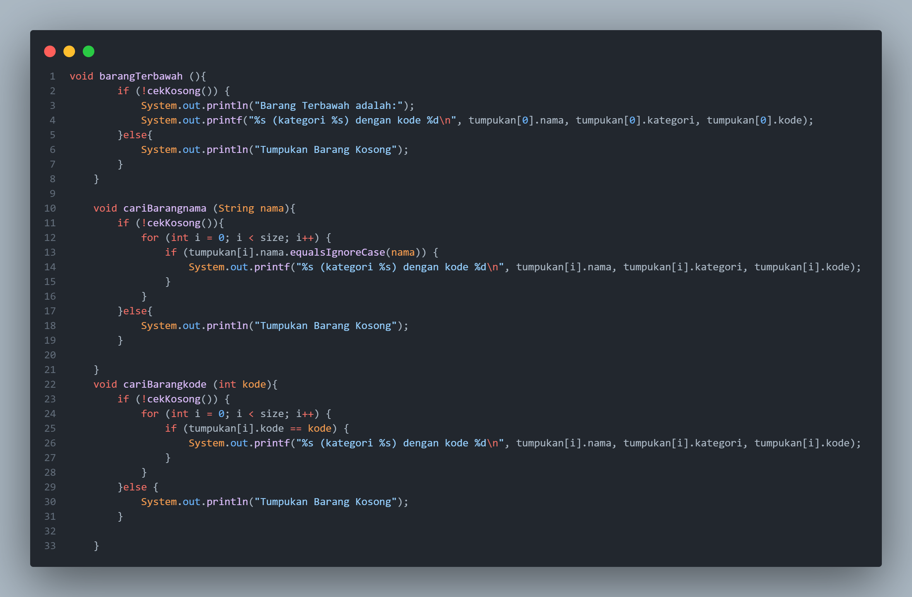

- **Utama10 Class :**

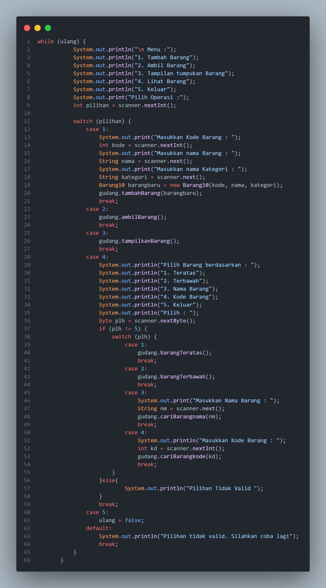

**Output :**

- **Data Inputan** 

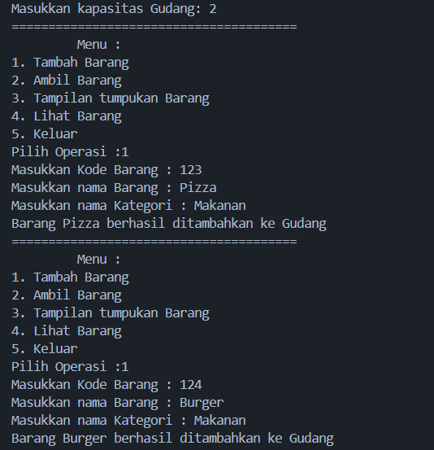

- **Lihat Barang Terbawah**

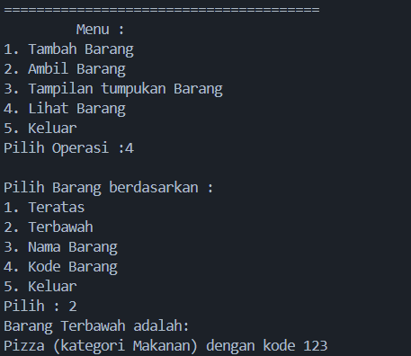

- **Lihat Barang berdasarkan nama Barang**

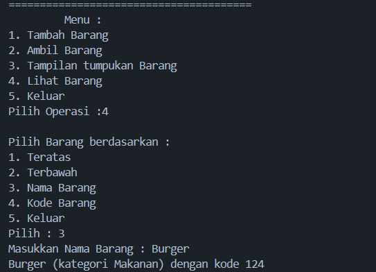

- **Lihat Barang berdasarkan kode Barang**

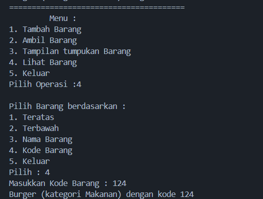